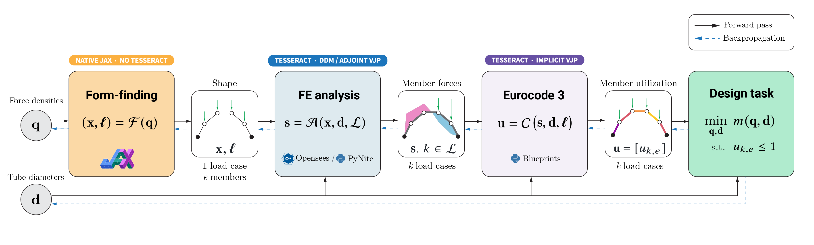
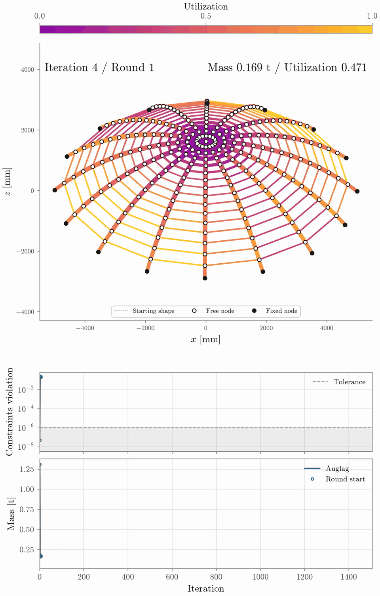
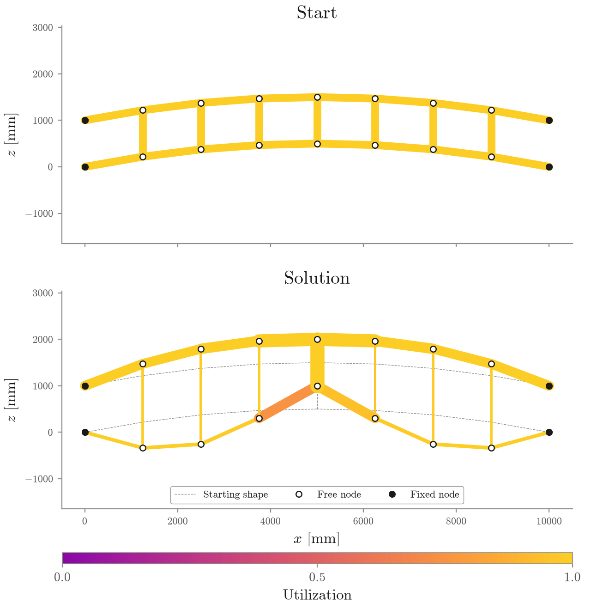

# Normax

[](https://github.com/arpastrana/normax/actions/workflows/test.yml)
[](https://www.python.org/downloads/release/python-3120/)
[](LICENSE)
[](https://pasteurlabs.ai/tesseract-hackathon-2026/)

> Tesseract Hackathon 2026 submission — Track 01: Inverse Design & Shape Optimization

Normax empowers engineers to minimize material through shape optimization of beam structures subject to an implemented Eurocode 3 cross-section check.
It does so by turning structural form finding, finite element analysis, and Eurocode 3 cross-section checks into a single differentiable program.
These three stages are traditionally disjoint in the industry; this project fuses them for end-to-end gradient-based optimization.

<a href="figures/normax_pipeline.png">
  
</a>

## Motivation: design segregation in structural engineering

Designing the backbone structure of a roof, a bridge, or a tower remains a fragmented process. Form finding, structural analysis, and code compliance are treated as distinct problems, addressed sequentially throughout the design cycle of architectural structures — from inception to realization. While engineering choices move forward, design feedback based on performance metrics rarely travels back.

When a structure is found deficient at later stages, it is often too late: fewer variables remain to satisfy performance goals, as the shape has been set in stone, leaving the engineer to increase member cross-sections to make the structure work.
Yet the history of structural engineering shows, time and again, that sculpting the shape from the outset has the more potent effect on performance.

This disconnect across stages also carries an environmental cost as engineers design safe but oversized meter-scale structural systems.
Buildings and construction account for about 34% of energy-related CO₂ emissions and consume nearly half of all extracted materials, according to the [UN Environment Programme's 2025–2026 global status
report](https://www.unep.org/resources/report/global-status-report-buildings-and-construction-2025-2026).
Reducing that footprint therefore asks for design approaches that state material reduction and safety as one problem rather than two. Concretely: less material through stiffer form, and safety through code compliance and maximized member utilization, decided together.

Normax responds to this important engineering and societal challenge through the lens of differentiable programming, as enabled by [Tesseract](https://github.com/pasteurlabs/tesseract-core).
By backpropagating later-stage norms into early-stage shape decisions, geometry and cross-section properties work hand in hand to minimize material consumption while satisfying the implemented cross-section constraints.

## What is special about Normax?

Normax is in the business of mass minimization (our primary goal).
To do so without overstressing members (our regulation constraint) under various load conditions (e.g., wind, pedestrians, traffic), Normax feeds the outputs of one solver (i.e., a function) into the next, and operates in reverse during optimization.
First, JAX FDM maps force densities to a funicular geometry via an equilibrium solve.
Next, OpenSees or PyNite transforms that geometry and its load cases into member actions.
Finally, Blueprints applies
Eurocode 3 to evaluate or size compliant member sections.

The interesting part is that none of these components was designed to be differentiated in the same way.
Form finding is differentiated natively and implicitly through JAX.
Structural analysis in 2D uses sensitivities compiled into the C++ core of OpenSees decades ago.
Finite element analysis in 3D through PyNite and the Eurocode 3 check use hand-derived vector-Jacobian products.
Eurocode 3 is especially instructive.
A building code is a normative specification, not a numerical solver, so it has no natural notion of a derivative.
Giving it a differentiable computational representation lets the law participate in the same optimization loop as an autodiff-native form finder.

To a gradient-based optimizer, these distinctions disappear.
Tesseract glues together software from different eras, languages, and differentiation schemes.
That glue is a two-way street.
Values flow forward through the design stages.
Gradients flow backward as useful search directions through a high-dimensional design space.
The figure below shows what that buys: the same gridshell dome designed three times under three load cases, the mass falling from left to right — and the lightest answer comes from the smallest shaped design space.

<table>
  <tr>
    <td width="33%" align="center" valign="top">
      
      <b>Sections only</b><br>
      <sub>0.138 t</sub>
    </td>
    <td width="33%" align="center" valign="top">
      
      <b>Heights + sections</b><br>
      <sub>0.091 t (&minus;34.0%)</sub>
    </td>
    <td width="33%" align="center" valign="top">
      
      <b>End-to-end</b><br>
      <sub>0.081 t (&minus;41.5%)</sub>
    </td>
  </tr>
</table>

## Contributions

| Contribution | Evidence |
|---|---|
| One differentiable form-finding, structural-analysis, and code-compliance program | [executable Quickstart](#quickstart) and [forward/backward diagrams](#one-program-three-kinds-of-differentiation) |
| Swappable OpenSees and PyNite analysis backends | one-line [backend change](#quickstart) behind one Tesseract schema |
| Backpropagation through the implemented Eurocode 3 check | [derivation](docs/blueprints_backward_pass.md) and [four-way gradient agreement to a tight tolerance](validation/blueprint_adjoint.py) |
| Matched end-to-end, free-heights, and sizing-only study | [accepted results and comparison protocol](docs/results.md) across four completed systems, with [committed archives and provenance](data/accepted_results.json) |

## The optimization problem

For force densities $\mathbf q$, diameters $\mathbf d$, and load cases $\mathcal L$, Normax composes three maps:

$$
\begin{aligned}
(\mathbf x,\boldsymbol\ell) &= \mathcal F(\mathbf q)
&& \text{form finding: geometry and member lengths}, \\
\mathbf s &= \mathcal A(\mathbf x,\mathbf d,\mathcal L)
&& \text{structural analysis: member actions}, \\
\mathbf u &= \mathcal C(\mathbf s,\mathbf d,\boldsymbol\ell)
&& \text{code check: utilization}.
\end{aligned}
$$

The simultaneous design problem is

$$
\begin{aligned}
\min_{\mathbf q,\mathbf d}\quad
& m(\mathbf q,\mathbf d)
= \rho\sum_{e=1}^{n} a(d_e)\,\ell_e(\mathbf q) \\
\text{subject to}\quad
& u_{k,e}(\mathbf q,\mathbf d) \le 1
&& \forall\ \text{load cases } k\ \text{and members } e, \\
& \mathbf g_{\mathrm{geometry}}(\mathbf x) \le \mathbf 0,
\qquad \mathbf q\in\mathcal Q,\quad \mathbf d\in\mathcal D.
\end{aligned}
$$

We solve this problem with an augmented Lagrangian, L-BFGS-B in its inner loop; the two example guides show how the convergence curves are read.
Every symbol above has a concrete role:

| Symbol | Meaning |
|---|---|
| $\mathbf q$, $\mathcal Q$ | member force densities and their admissible set |
| $\mathbf d$, $\mathcal D$ | member diameters and their admissible box |
| $\mathcal L$, $k$ | prescribed load cases and one load-case index |
| $e$, $n$ | one member index and the number of members |
| $\mathcal F$ | JAX FDM form-finding map |
| $\mathbf x$, $\boldsymbol\ell$, $\ell_e$ | nodal coordinates, all member lengths, and the length of member $e$ |
| $\mathcal A$, $\mathbf s$ | OpenSees or PyNite structural-analysis map and its member actions |
| $\mathcal C$, $\mathbf u$, $u_{k,e}$ | Blueprints code-check map, its utilization matrix, and one load-case/member utilization |
| $\rho$, $a(d_e)$ | steel density and circular-hollow-section area at diameter $d_e$ |
| $m$ | total steel mass |
| $\mathbf g_{\mathrm{geometry}}$, $\mathbf 0$ | geometric inequality vector and its feasible upper bound |

To make gradient-based optimization through the Eurocode 3 check more tractable, the section space is deliberately narrow.
Every member is assigned a circular hollow section (CHS) made of steel grade S355, fixed at the Class 3 slenderness limit

$$
\frac{d}{t}=90\frac{235}{f_y} \approx 59.58,
\qquad
t=\frac{d}{59.58},
\qquad
d_i=d-2t.
$$

Only the outer diameter $d$ moves.
Wall thickness $t$ and inner diameter $d_i$ follow from the precomputed ratio. This keeps classification fixed by construction and removes a discrete class switch from the differentiated problem (Eurocode 3 considers four distinct section classes: 1, 2, 3, and 4).
The [Blueprints backward-rule guide](docs/blueprints_backward_pass.md) provides details on the derivation.

Code utilization, geometry, signs, and box bounds constrain the mass objective, and the composition they constrain is the one that is differentiated.

## Software stack

[Tesseract](https://github.com/pasteurlabs/tesseract-core) and
[Tesseract-JAX](https://github.com/pasteurlabs/tesseract-jax) provide the
shared schema and JAX boundary. Each numerical stage keeps its own
implementation and derivative strategy:

| Stage | Software | Language | Differentiation used by Normax |
|---|---|---|---|
| Form finding | [JAX FDM](https://github.com/arpastrana/jax_fdm) ([method paper](https://doi.org/10.1016/j.cma.2026.118783)) | Python and JAX | native JAX reverse mode through the equilibrium solve |
| Structural analysis (2D) | [OpenSees](https://opensees.berkeley.edu/) ([framework paper](https://doi.org/10.1109/MCSE.2011.66)) | C++ core with a Python interface | native Direct Differentiation Method forward sensitivities assembled into a VJP |
| Structural analysis (3D) | [PyNite](https://github.com/JWock82/Pynite) | Python | no native derivatives, so Normax supplies an implicit structural adjoint |
| Code compliance | [Blueprints](https://github.com/Blueprints-org/blueprints) | Python | no native derivatives, so Normax supplies a hand-derived VJP for the fixed Class 3 CHS slice |

## The advantages of Tesseract for structural engineering

Tesseract's advantage is not autodiff by another name. It is one schema behind
which each stage supplies the strongest derivative it has, while the optimizer
sees the same JAX-callable and vector-Jacobian product in every case. The
separation also preserves the software the project intends to optimize
through: switching OpenSees for PyNite changes one backend input, not the
pipeline.

### Why not `jax.custom_vjp`?

A one-off, Python-only version of this experiment could wrap each host call in
`jax.custom_vjp`. That would make Normax itself own three different integration
contracts, however, and tie every solver's derivative to one autodiff client.
Here the derivative stays with the component that can compute it best: the
OpenSees-backed component exposes the C++ solver's Direct Differentiation
Method, the PyNite-backed component exposes Normax's implicit structural
adjoint, and the Blueprints-backed component exposes Normax's code-check
pullback. Tesseract gives all three the same typed forward/VJP boundary, lets
the analysis backend change without changing the optimization program, and
leaves that boundary usable by clients other than JAX. The point is therefore
not that a custom VJP is impossible; it is that the solver and its derivative
become one swappable component rather than application-specific glue.

## Results

Four accepted studies now compare the joined form-and-sizing search with sizing
the same topology at its fixed starting geometry: three planar systems through
OpenSees and a spatial gridshell through PyNite. Every route opens on that same
geometry and the same diameters. Loads, material, section model, code check,
optimizer, and acceptance tolerance stay fixed; only shape freedom changes.

Masses are tonnes of steel. `Fixed` changes only diameters. `Free heights`
changes permitted nodal heights and diameters. `Form + sizing` changes force
densities and diameters through the joined program.

| Structure | Analysis | Fixed | Free heights | Form + sizing | Form vs fixed | Worst form utilization |
|---|---|---:|---:|---:|---:|---:|
| Arch | OpenSees | 0.517654 | **0.154561** | 0.171684 | **66.83% less** | 1.000000 |
| Warren truss | OpenSees | 0.071797 | 0.051188 | **0.050743** | **29.32% less** | 1.000001 |
| Vierendeel truss | OpenSees | 0.277435 | 0.136498 | **0.120819** | **56.45% less** | 1.000001 |
| Gridshell | PyNite | 0.138421 | 0.091303 | **0.080954** | **41.52% less** | 1.000001 |

Every row is a converged local landing within the configured $10^{-6}$
constraint tolerance. These are continuous-section research results under the
implemented Eurocode 3 cross-section check, not code-complete or globally
optimal designs. The matched protocol and the wider free-heights diagnostic
keep the comparison reproducible and its claim narrow.
The [twelve accepted archives and their provenance](data/accepted_results.json)
are committed so every comparison can be inspected or redrawn from a clean
clone without rerunning optimization.

The fixed route is the headline baseline: it isolates the value of allowing
the common starting geometry to move. Free heights is a separate, larger design
space used to interrogate the force-density shape prior. It is 9.97% lighter than
form + sizing on the arch. Form + sizing is 0.87% lighter on the Warren, 11.49%
lighter on the Vierendeel, and 11.33% lighter on the gridshell. Normax
therefore claims neither that the prior must always win nor that these local
optima are global certificates.

<table>
  <tr>
    <td width="33%" align="center" valign="top">
      
      <b>Arch &mdash; 66.8% lighter</b><br>
      <sub>0.172 t, against 0.518 t at the fixed drawn geometry</sub>
    </td>
    <td width="33%" align="center" valign="top">
      
      <b>Warren truss &mdash; 29.3% lighter</b><br>
      <sub>0.051 t, against 0.072 t at the fixed drawn geometry</sub>
    </td>
    <td width="33%" align="center" valign="top">
      
      <b>Vierendeel truss &mdash; 56.5% lighter</b><br>
      <sub>0.121 t, against 0.277 t at the fixed drawn geometry</sub>
    </td>
  </tr>
</table>

The per-structure story — problem framing, load-case diagrams, start and
solution designs, and the descent films — is told in
[the planar structures guide](docs/planar_structures.md) and
[the gridshell guide](docs/gridshell.md). See
[the results record](docs/results.md) for the protocol, tolerances, final
tables, and figure provenance.

## Installation

Normax requires Python 3.12. Clone the repository and let
[`uv`](https://docs.astral.sh/uv/) create the project environment:

```bash
git clone https://github.com/arpastrana/normax.git
cd normax
uv sync --frozen
```

## Quickstart

Suppose a pedestrian bridge must cross a ten-meter ravine in the Grand
Canyon. The terrain fixes two rocky abutments. The deck supplies a load. The
steel arch that will serve as its backbone is still negotiable. We want one
function that finds its equilibrium geometry, runs structural analysis, checks
Eurocode 3, and tells us how mass changes with the force densities.

Normax keeps that function compact and legible. Tesseract makes the analysis and
code implementations look like ordinary JAX calls:

```python
import jax
import jax.numpy as jnp

from normax.design import DesignParameters
from normax.design import StructuralDesignPipeline
from normax.design import compute_mass
from normax.form_finding import FdmFormFinder
from normax.loads import assemble_load_cases
from normax.loads import create_load_uniform
from normax.materials import Steel355
from normax.sections import build_section_catalog
from normax.structures import build_arch_2d
from normax.tesseract import TesseractAnalyzer
from normax.tesseract import TesseractSizer

num_edges = 20
diameter_start = 100.0
force_density_start = -50.0
section_class = 3
material = Steel355()

# Problem setup
structure = build_arch_2d(num_edges, span=10_000.0, rise=3_000.0)
load_case = create_load_uniform(structure, 15_000.0)
loads = assemble_load_cases([load_case])
section_catalog = build_section_catalog(material, section_class)

# The three main computation blocks of the structural design pipeline
form_finder = FdmFormFinder(structure)
analyzer = TesseractAnalyzer(structure, section_catalog, backend="opensees")
sizer = TesseractSizer(structure, section_catalog, backend="blueprint")

# One ring to rule them all
pipeline = StructuralDesignPipeline(form_finder, analyzer, sizer)

# Design parameters: one force density and one diameter per member
force_densities = jnp.full(num_edges, force_density_start)
diameters = jnp.full(num_edges, diameter_start)


# "How much does your building weigh, Mr. Foster?" (Fuller, 1978)
def compute_lawful_mass(force_densities):
    parameters = DesignParameters(force_densities, diameters)
    design = pipeline(parameters, loads)
    return compute_mass(design), design


# One pass for the mass, its gradient, and the design the two describe
compute_mass_and_gradient = jax.value_and_grad(compute_lawful_mass, has_aux=True)
(mass, design), gradient = compute_mass_and_gradient(force_densities)

# Does every member pass the implemented Eurocode 3 cross-section check?
passes_implemented_check = jnp.all(design.sizes.utilization <= 1.0)

print(mass)  # tonnes of steel
print(gradient)  # the gradient of the mass
print(passes_implemented_check)  # True when the implemented check passes
```

Run the same snippet from the repository:

```bash
uv run python examples/readme.py
```

[`examples/readme.py`](examples/readme.py) evaluates mass and utilization, then
differentiates through both Tesseract boundaries.

To use the other analysis backend, replace one line:

```python
analyzer = TesseractAnalyzer(structure, section_catalog, backend="pynite")
```

The pipeline, schema, and JAX-facing API stay fixed. The two solvers differ in
era, language, and derivative strategy (see the [software stack](#software-stack));
Normax gives each its own derivative rule behind the same call.

The snippet evaluates one design and its gradient. Let the optimizer move force
densities and diameters with:

```bash
uv run python examples/arch.py
```

## More examples

Once the arch runs, three more studies exercise the same pipeline on other structural systems.
Each Python file reads the YAML beside it and exports the data and figures shown in the results section above:

```bash
uv run python examples/warren.py
uv run python examples/vierendeel.py
uv run python examples/gridshell.py
```

The three planar systems answer one bridge problem — a deck to carry across a ravine — and the gridshell roofs a public space; [the planar structures guide](docs/planar_structures.md) and [the gridshell guide](docs/gridshell.md) tell each story.
The shared problem statements are drawn on their own, without running a search:

```bash
uv run python examples/problem_setup.py
```

Every example exposes all three shape parametrizations; switch the flag to reproduce the baselines:

```bash
uv run python examples/arch.py --shape-parametrization fixed
uv run python examples/arch.py --shape-parametrization heights
```

The options mean:

- `fdm`: optimize member force densities on a lower-dimensional subspace that maintains a fixed horizontal projection — the results table's form + sizing route.
- `heights`: optimize free node heights directly — free heights.
- `fixed`: hold geometry fixed and optimize sections — the fixed baseline.

## Technical notes and guides

These notes preserve the example narratives, derivations, verification protocol, and engineering work behind the small public API of Normax:

- [The planar structures: three backbones for one ravine](docs/planar_structures.md)
- [The gridshell: a roof for a public space](docs/gridshell.md)
- [Results and experiment protocol](docs/results.md)
- [Reproducibility guide](docs/reproducibility.md)
- [Backpropagating through Eurocode 3 with Blueprints](docs/blueprints_backward_pass.md)
- [Building the PyNite backward pass](docs/fast_backward_pass.md)
- [Finding and mitigating a Tesseract concurrency race](docs/tesseract_stdio_race.md)

## Verification

Tests run the Tesseract APIs in process. They need neither Docker nor a network
service.

```bash
uv run pytest
uv run ruff check .
uv run ruff format --check .
```

Focused scripts compare each reverse rule with solver identities, element
formulas, closed forms, and central differences:

```bash
uv run python validation/opensees_ddm.py
uv run python validation/pynite_adjoint.py
uv run python validation/blueprint_adjoint.py
```

Exact commands, expected outputs, platform notes, and environment-capture
instructions are collected in [the reproducibility guide](docs/reproducibility.md).

## One program, three kinds of differentiation

Each stage appears as one function despite different languages, data models,
and differentiation strategies. The figure at the top of this page is that
composition; below is the same thing named stage by stage, including which
derivative rule each boundary carries.

```text
Forward pass

            force densities q               section diameters d
                  │                                  │
                  ▼                                  │
       JAX force-density form finding                │
       equilibrium solve + held-plan basis           │
                  │ geometry x, lengths L            │
                  └────────────────┬─────────────────┘
                                   ▼
                     Tesseract: structural analysis
                       OpenSees (2D) / PyNite (3D)
                                   │ member actions
                                   ▼
                     Tesseract: section check
                       Blueprints / Eurocode 3
                                   │ utilization U
                  ┌────────────────┴─────────────────┐
                  │                                  │
          mass m(x, L, d)                   constraints U ≤ 1
                  └────────────────┬─────────────────┘
                                   ▼
                     augmented-Lagrangian optimizer
```

The optimizer sees one composition. Its reverse pass follows the same route in
the other direction:

```text
Backward pass

 objective m                         constraints U ≤ 1
      │ direct cotangents                     │
      │ on geometry and d                     ▼
      │                    Blueprints check VJP: hand adjoint
      │                                       │ actions, d
      │                                       ▼
      │                    structural-analysis VJP
      │                      OpenSees: solver sensitivities
      │                      PyNite: implicit structural adjoint
      │                                       │ geometry, d
      └───────────────────┬───────────────────┘
                          ▼
        JAX / implicit form-finding pullback + accumulation
                          │
                          ▼
                  gradients ∂L/∂q and ∂L/∂d
```

Note that this is not a surrogate.
Every design evaluation calls the crossed analysis and Blueprints check.
Backprop calls their derivative endpoints via the implemented, custom VJP rules.

## Scope and limitations

Normax reached a minimum viable product through deliberate simplifications, and its results are read under them:

- Member checks cover Eurocode 3 cross-section resistance under axial force with biaxial bending. Flexural buckling, shear, torsion, and global stability are excluded for simplicity.
- Every member section is constrained to Class 3 and its limiting diameter-to-thickness ratio is fixed before optimization.
- Each study carries three load cases as alternatives with no combination factors: a uniform, a half-span, and a midspan point load on the bridges; a tributary pressure and two mirrored drifts on the gridshell.
- Local Tesseract dispatch is serialized because the hosted solvers and runtime redirection have mutable,
  thread-sensitive state.

## Next steps

With limitations comes hope (and more work). Normax opens several exciting directions for research development:

- **Displacement optimization.** Serviceability limits are code-defined too, and displacement utilization should bound a design beside the strength check shown here.
- **Differentiate more of the norm.** Extend the current Eurocode checks to the multi-class case with branch-aware relaxations and exact final checks.
- **Swap the form-finding prior.** Put [JAX-CEM](https://github.com/arpastrana/jax_cem) and other differentiable form-finding solvers behind the same stage contract as JAX FDM. Tesseract should make this easy.
- **Reach commercial software.** Host established FEA and code-compliance tools behind Tesseract services called through Web APIs, with explicit derivative contracts for sensitivities, adjoints, or numerical pullbacks. Availability of these APIs is, alas, limited and paywalled.

## Repository map

| Path | Purpose |
|---|---|
| [`normax/design.py`](normax/design.py) | pipeline, objectives, constraints, and optimization problem |
| [`normax/form_finding.py`](normax/form_finding.py) | force-density, free-heights, and fixed-geometry parametrizations |
| [`normax/tesseract.py`](normax/tesseract.py) | JAX-facing structural-analysis and sizing blocks |
| [`tesseracts/analysis`](tesseracts/analysis) | OpenSees and PyNite Tesseract API and backends |
| [`tesseracts/sizing`](tesseracts/sizing) | Blueprints check Tesseract API and adjoint |
| [`examples`](examples) | four reproducible design studies and their YAML configurations |
| [`validation`](validation) | focused numerical and derivative checks |
| [`tests`](tests) | unit, composition, parity, and regression tests |

## License

Normax is released under the [Apache License 2.0](LICENSE). Third-party solvers,
libraries, and standards retain their own terms. Citation metadata is in
[`CITATION.cff`](CITATION.cff).
