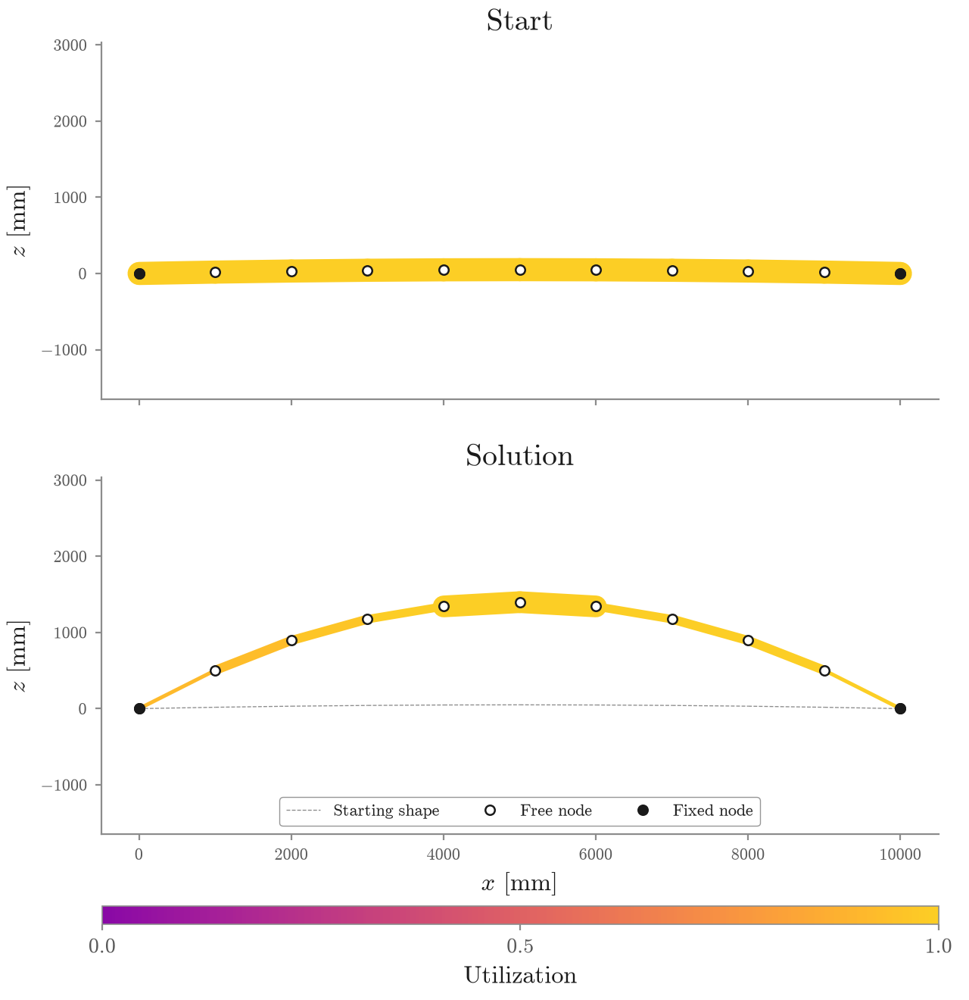
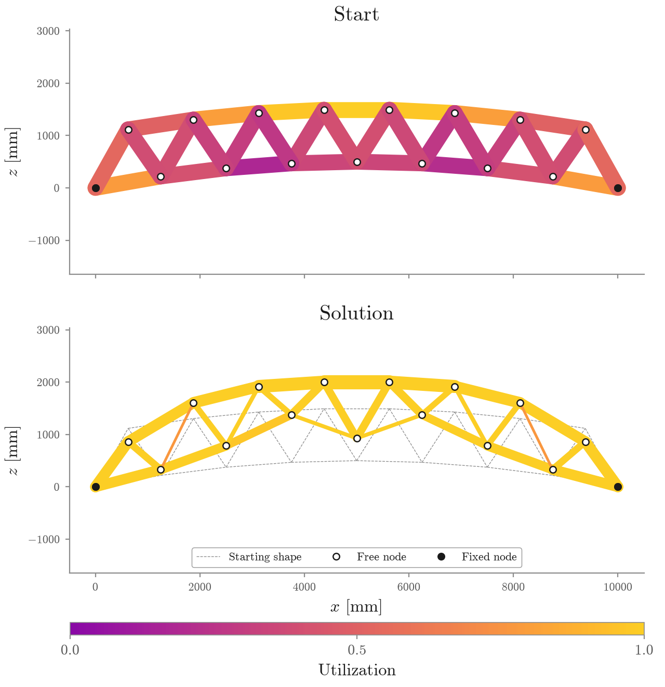
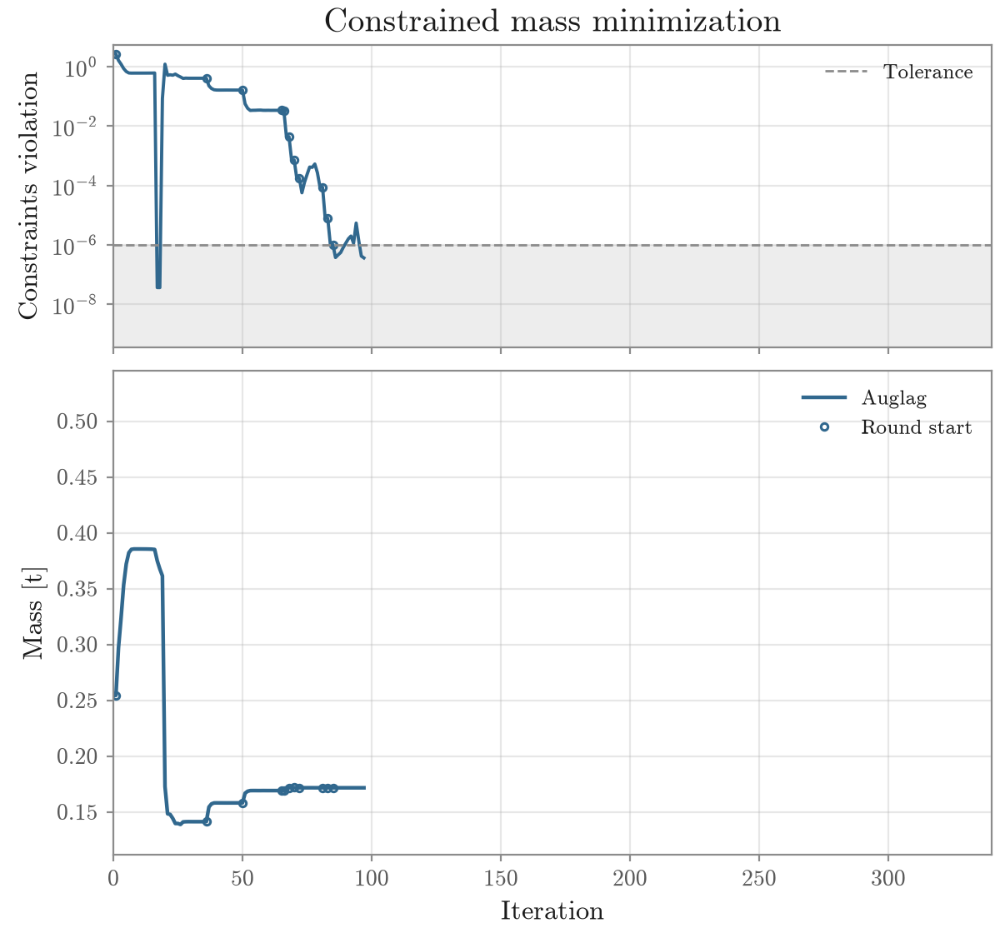

# normax

[](https://github.com/arpastrana/normax/actions/workflows/test.yml)
[](https://www.python.org/downloads/release/python-3120/)
[](LICENSE)
[](https://pasteurlabs.ai/tesseract-hackathon-2026/)

> Backpropagating through structural engineering codes.

**Normax is a Tesseract Hackathon 2026 submission for Track 01: Inverse Design
& Shape Optimization.** It turns structural form finding, structural analysis,
and Eurocode cross-section checks into one differentiable design program.

**Normax makes a downstream safety check reshape the upstream structure.** The
optimizer does not stop at differentiating a form finder or a finite-element
solver: a utilization constraint evaluated by engineering-code software sends
its gradient back through analysis and into both geometry and member sizes.

```text
[JAX FDM form finding] → [OpenSees / PyNite structural analysis] → [Blueprints code check]
          ↑                                                               │
          └─────────── mass + code gradients flow back ────────────────────┘
```

Geometry and member actions move to the right. Gradients of steel mass and code
utilization move back to the left, so all three stages participate in one
design decision.

## Evidence at a glance

Three accepted planar studies now compare the joined form-and-sizing search
with sizing the same topology at its fixed starting geometry. Every route opens
on that same geometry and the same diameters. Loads, material, section model,
code check, optimizer, and acceptance tolerance stay fixed; only shape freedom
changes.

| Structure | Fixed geometry + sizing [t] | Form + sizing [t] | Less steel vs fixed | Worst utilization |
|---|---:|---:|---:|---:|
| Arch | 0.517654 | 0.171684 | **66.83%** | 1.000000 |
| Warren truss | 0.071797 | 0.050743 | **29.32%** | 1.000001 |
| Vierendeel truss | 0.277435 | 0.120819 | **56.45%** | 1.000001 |

Every row is a converged local landing within the configured $10^{-6}$
constraint tolerance. These are continuous-section research results under the
implemented Eurocode 3 cross-section check, not code-complete or globally
optimal designs. The [matched protocol and the wider free-height
diagnostic](docs/results.md) keep the comparison reproducible and its claim
narrow.

The derivative evidence is numerical too. In the focused Blueprints validation,
forward mode, reverse mode, closed-form differentiation, and central differences
agree to a worst relative error of $6.70\times10^{-9}$. The crossed and
in-process sizing routes return identical sizes and gradients, and the
validation arch's mass gradient agrees with central differences to
$6.91\times10^{-10}$.

## Motivation: design segregation in structural engineering

Laws are paramount for safety. Yet structural design remains segregated in
research and industry. Form finding, structural analysis, and code compliance
are treated as distinct problems, built by different communities in different
eras. Information moves forward, but design feedback rarely travels back. A
late code check can enlarge a section. It cannot readily reshape the structure
that created the demand.

This disconnect also carries an environmental cost. Construction produces
about 37% of global CO₂ emissions and consumes nearly half of extracted
materials, according to the
[UN Environment Programme's 2025–2026 global status
report](https://www.unep.org/resources/report/global-status-report-buildings-and-construction-2025-2026).
The choice is not safety or sustainability. Safety is not negotiable. The
question is whether mechanical efficiency and code compliance can become the
same design problem.

Normax composes the three traditionally separate stages into one differentiable
program for meter-scale structures made of beam members. First, JAX FDM maps
force densities to a funicular geometry. Next, OpenSees or PyNite transforms
that geometry and its load cases into member actions. Finally, Blueprints
applies
[Eurocode 3](https://eurocodes.jrc.ec.europa.eu/EN-Eurocodes/eurocode-3-design-steel-structures)
to evaluate or size member sections that comply with the implemented slice of
the law. The composition is one function that can be optimized end to end with
exact gradients inside that declared continuous slice.

The interesting part is that none of these components was designed to be
differentiated in the same way. Form finding is differentiated natively and
implicitly through JAX. Planar structural analysis uses sensitivities compiled
into the C++ core of OpenSees years before this pipeline existed. Spatial
analysis through PyNite and the Eurocode 3 check use hand-derived adjoints.
Eurocode 3 is especially instructive. A building code is a normative
specification, not a numerical solver, so it has no natural notion of a
derivative. Giving the check a differentiable computational representation lets
the law participate in the same optimization loop as an autodiff-native form
finder.

To a gradient-based optimizer, these distinctions disappear. Tesseract glues
together software from different eras, languages, and differentiation schemes.
That glue is a two-way street. Values flow forward through the design stages.
Gradients flow backward as useful search directions through a high-dimensional
design space.

Backpropagating later-stage law into early-stage shape decisions is where the
magic happens. **Only the joined program lets geometry and sections respond
together to the same loads and code constraints.** The experiments compare
that search with fixed-geometry sizing and free nodal heights. Across the three
completed planar systems, form and sizing together use 29.32% to 66.83% less
steel than sizing the fixed starting geometry alone.

<!-- FINAL: HERO_ANIMATION: add figures/hero.gif, then uncomment the line below. -->
<!--  -->

## Contributions

| Contribution | Evidence |
|---|---|
| One differentiable form-finding, structural-analysis, and code-compliance program | [executable Quickstart](#quickstart) and [forward/backward diagrams](#one-program-three-kinds-of-differentiation) |
| Swappable OpenSees and PyNite analysis backends | one-line [backend change](#quickstart) behind one Tesseract schema |
| Backpropagation through the implemented Eurocode 3 check | [derivation](docs/blueprints_backward_pass.md) and [four-way gradient agreement to $6.70\times10^{-9}$](validation/blueprint_adjoint.py) |
| Matched end-to-end, free-height, and sizing-only study | [accepted results and comparison protocol](docs/results.md) across three completed planar systems, with the gridshell in progress |

## The optimization problem

For force densities $\mathbf q$, diameters $\mathbf d$, and load cases
$\mathcal L$, Normax composes three maps:

$$
\begin{aligned}
(\mathbf x,\boldsymbol\ell) &= \mathcal F(\mathbf q)
&& \text{form finding: geometry and member lengths}, \\
\mathbf s &= \mathcal A(\mathbf x,\mathbf d,\mathcal L)
&& \text{structural analysis: member actions}, \\
\mathbf u &= \mathcal C_{\mathrm{Eurocode\,3}}(\mathbf s,\mathbf d,\boldsymbol\ell)
&& \text{code check: utilization}.
\end{aligned}
$$

The simultaneous design problem is

$$
\begin{aligned}
\min_{\mathbf q,\mathbf d}\quad
& m(\mathbf q,\mathbf d)
= \rho\sum_{e=1}^{n} A_{\mathrm{CHS}}(d_e)\,\ell_e(\mathbf q) \\
\text{subject to}\quad
& u_{k,e}(\mathbf q,\mathbf d) \le 1
&& \forall\ \text{load cases } k\ \text{and members } e, \\
& \mathbf g_{\mathrm{geometry}}(\mathbf x) \le \mathbf 0,
\qquad \mathbf q\in\mathcal Q,\quad \mathbf d\in\mathcal D.
\end{aligned}
$$

Every symbol has a concrete role:

| Symbol | Meaning |
|---|---|
| $\mathbf q$, $\mathcal Q$ | member force densities and their admissible set |
| $\mathbf d$, $\mathcal D$ | member diameters and their admissible box |
| $\mathcal L$, $k$ | prescribed load cases and one load-case index |
| $e$, $n$ | one member index and the number of members |
| $\mathcal F$ | JAX FDM form-finding map |
| $\mathbf x$, $\boldsymbol\ell$, $\ell_e$ | nodal coordinates, all member lengths, and the length of member $e$ |
| $\mathcal A$, $\mathbf s$ | OpenSees or PyNite structural-analysis map and its member actions |
| $\mathcal C_{\mathrm{Eurocode\,3}}$, $\mathbf u$, $u_{k,e}$ | Blueprints code-check map, its utilization matrix, and one load-case/member utilization |
| $\rho$, $A_{\mathrm{CHS}}(d_e)$ | steel density and circular-hollow-section area at diameter $d_e$ |
| $m$ | total steel mass |
| $\mathbf g_{\mathrm{geometry}}$, $\mathbf 0$ | geometric inequality vector and its feasible upper bound |

The section space is deliberately narrow. Every headline member is an S355
circular hollow section (CHS) fixed at the Class 3 slenderness limit

$$
\frac{d}{t}=90\frac{235}{f_y} \approx 59.58,
\qquad
t=\frac{d}{59.58},
\qquad
d_i=d-2t.
$$

Only the outer diameter $d$ moves. Wall thickness $t$ and inner diameter $d_i$
follow from the precomputed ratio. This keeps classification fixed by
construction and removes a discrete class switch from the differentiated
problem. It is a tractability choice, not a general catalog model. The
[Blueprints backward-rule guide](docs/blueprints_backward_pass.md) gives the
derivation.

Normax differentiates this actual composition. Code utilization, geometry,
signs, and box bounds constrain the mass objective.

## Software stack

Tesseract and Tesseract-JAX provide the shared schema and JAX boundary. Each
numerical stage keeps its own implementation and derivative strategy:

| Stage | Software | Language | Differentiation used by Normax |
|---|---|---|---|
| Form finding | [JAX FDM](https://github.com/arpastrana/jax_fdm) ([method paper](https://doi.org/10.1016/j.cma.2026.118783)) | Python and JAX | native JAX reverse mode through the equilibrium solve |
| Structural analysis (2D) | [OpenSees](https://opensees.berkeley.edu/) ([framework paper](https://doi.org/10.1109/MCSE.2011.66)) | C++ core with a Python interface | native Direct Differentiation Method forward sensitivities assembled into a VJP |
| Structural analysis (3D) | [PyNite](https://github.com/JWock82/Pynite) | Python | no native derivatives, so Normax supplies an implicit structural adjoint |
| Code compliance | [Blueprints](https://github.com/Blueprints-org/blueprints) | Python | no native derivatives, so Normax supplies a hand-derived VJP for the fixed Class 3 CHS slice |

## Results

Masses are tonnes of steel. Every route in a row keeps the topology, loads,
material, section model, code check, and optimizer fixed. `Fixed` changes only
diameters. `Free heights` changes permitted nodal heights and diameters.
`Form + sizing` changes force densities and diameters through the joined
program.

| Structure | Analysis | Fixed | Free heights | Form + sizing | Form vs fixed | Worst form utilization |
|---|---|---:|---:|---:|---:|---:|
| Arch | OpenSees | 0.517654 | **0.154561** | 0.171684 | **66.83% less** | 1.000000 |
| Warren truss | OpenSees | 0.071797 | 0.051188 | **0.050743** | **29.32% less** | 1.000001 |
| Vierendeel truss | OpenSees | 0.277435 | 0.136498 | **0.120819** | **56.45% less** | 1.000001 |
| Gridshell | PyNite | In progress | In progress | In progress | In progress | In progress |

The fixed route is the headline baseline: it isolates the value of allowing
the common starting geometry to move. Free heights is a separate, larger design
space used to interrogate the force-density shape prior. It is 9.97% lighter than
form finding on the arch; form finding is 0.87% lighter on the Warren and
11.49% lighter on the Vierendeel. Normax therefore claims neither that the
prior must always win nor that these local optima are global certificates.

<!-- FINAL: ARCH_DESIGNS: add figures/arch_designs.png, then uncomment below. -->
<!--  -->

<!-- FINAL: WARREN_DESIGNS: add figures/warren_designs.png, then uncomment below. -->
<!--  -->

<!-- FINAL: ARCH_OPTIMIZATION: add figures/arch_optimization.png, then uncomment below. -->
<!--  -->

See [the results record](docs/results.md) for the protocol, tolerances, final
tables, and figure provenance.

## Installation

Normax requires Python 3.12. Clone the repository and let
[`uv`](https://docs.astral.sh/uv/) create the project environment:

```bash
git clone https://github.com/arpastrana/normax.git
cd normax
uv sync --frozen
```

## Quickstart

Suppose a pedestrian bridge must cross a ten-metre ravine in the Rocky
Mountains. The terrain fixes two rocky abutments. The deck supplies a load. The
steel arch that will serve as its backbone is still negotiable. We want one
function that finds its equilibrium geometry, runs structural analysis, checks
Eurocode 3, and tells us how mass changes with the force densities.

Normax keeps that function compact and legible. Tesseract makes the analysis and
code implementations look like ordinary JAX calls:

```python
import jax
import jax.numpy as jnp

from normax.design import DesignParameters
from normax.design import StructuralDesignPipeline
from normax.design import compute_mass
from normax.form_finding import FdmFormFinder
from normax.loads import assemble_load_cases
from normax.loads import create_load_uniform
from normax.materials import Steel355
from normax.sections import build_section_catalog
from normax.structures import build_arch_2d
from normax.tesseract import TesseractAnalyzer
from normax.tesseract import TesseractSizer

num_edges = 20
diameter_start = 100.0
force_density_start = -50.0
section_class = 3
material = Steel355()

# Problem setup
structure = build_arch_2d(num_edges, span=10_000.0, rise=3_000.0)
load_case = create_load_uniform(structure, 15_000.0)
loads = assemble_load_cases([load_case])
section_catalog = build_section_catalog(material, section_class)

# The three main computation blocks of the structural design pipeline
form_finder = FdmFormFinder(structure)
analyzer = TesseractAnalyzer(structure, section_catalog, backend="opensees")
sizer = TesseractSizer(structure, section_catalog, backend="blueprint")

# One ring to rule them all
pipeline = StructuralDesignPipeline(form_finder, analyzer, sizer)

# Design parameters: one force density and one diameter per member
force_densities = jnp.full(num_edges, force_density_start)
diameters = jnp.full(num_edges, diameter_start)


# "How much does your building weigh, Mr. Foster?" (Fuller, 1978)
def compute_lawful_mass(force_densities):
    parameters = DesignParameters(force_densities, diameters)
    design = pipeline(parameters, loads)
    return compute_mass(design), design


# One pass for the mass, its gradient, and the design the two describe
compute_mass_and_gradient = jax.value_and_grad(compute_lawful_mass, has_aux=True)
(mass, design), gradient = compute_mass_and_gradient(force_densities)

# Does every member pass the implemented Eurocode 3 cross-section check?
passes_implemented_check = jnp.all(design.sizes.utilization <= 1.0)

print(mass)  # tonnes of steel
print(gradient)  # the mass' gradient
print(passes_implemented_check)  # True when the implemented check passes
```

Run the same snippet from the repository:

```bash
uv run python examples/readme.py
```

[`examples/readme.py`](examples/readme.py) evaluates mass and utilization, then
differentiates through both Tesseract boundaries.

To use the other analysis backend, replace one line:

```python
analyzer = TesseractAnalyzer(structure, section_catalog, backend="pynite")
```

The pipeline, schema, and JAX-facing API stay fixed. The solvers come from
different eras. [OpenSees](https://opensees.berkeley.edu/) is a long-established
C++ research framework with solver sensitivities.
[PyNite](https://github.com/JWock82/Pynite) is a structural analysis solver in
plain Python with no derivative API. Normax gives each backend its own
derivative rule behind the same call.

The snippet evaluates one design and its gradient. Let the optimizer move force
densities and diameters with:

```bash
uv run python examples/arch.py
```

## More examples

Once the arch runs, three more vignettes exercise the same pipeline on different
structural systems. Each reads the YAML beside it and exports the configured
data and figures:

```bash
uv run python examples/warren.py
uv run python examples/vierendeel.py
uv run python examples/gridshell.py
```

The three planar systems answer one bridge problem, and its statement — the
shared supported deck, its supports, and the three load cases — is drawn on its
own, without running a search:

```bash
uv run python examples/problem_setup.py
```

For the planar examples, use the same model and switch only the shape
parametrization to reproduce the baselines:

```bash
uv run python examples/arch.py --shape-parametrization fixed
uv run python examples/arch.py --shape-parametrization heights
```

The options mean:

- `fdm`: optimize reduced force-density coordinates and recover equilibrium.
- `heights`: optimize free node heights directly.
- `fixed`: hold geometry fixed and optimize sections.

## Technical notes and guides

These six notes preserve the derivations, verification protocol, and
engineering work behind the small public API:

- [Results and experiment protocol](docs/results.md)
- [Reproducibility guide](docs/reproducibility.md)
- [Backpropagating through Eurocode 3 with Blueprints](docs/blueprints_backward_pass.md)
- [Building the PyNite backward pass](docs/fast_backward_pass.md)
- [Finding and mitigating a Tesseract concurrency race](docs/tesseract_stdio_race.md)
- [Which way the truss bulges](docs/shape_sign.md)

## Verification

Tests run the Tesseract APIs in process. They need neither Docker nor a network
service.

```bash
uv run pytest
uv run ruff check .
uv run ruff format --check .
```

Focused scripts compare each reverse rule with solver identities, element
formulas, closed forms, and central differences:

```bash
uv run python validation/opensees_ddm.py
uv run python validation/pynite_adjoint.py
uv run python validation/blueprint_adjoint.py
```

Exact commands, expected outputs, platform notes, and environment-capture
instructions are collected in [the reproducibility guide](docs/reproducibility.md).

## One program, three kinds of differentiation

Each stage appears as one function despite different languages, data models,
and differentiation strategies.

```text
Forward pass

            force densities q               section diameters d
                  │                                  │
                  ▼                                  │
       JAX force-density form finding                │
       equilibrium solve + held-plan basis           │
                  │ geometry x, lengths L            │
                  └────────────────┬─────────────────┘
                                   ▼
                     Tesseract: structural analysis
                       OpenSees (2D) / PyNite (3D)
                                   │ member actions
                                   ▼
                     Tesseract: section check
                       Blueprints / Eurocode 3
                                   │ utilization U
                  ┌────────────────┴─────────────────┐
                  │                                  │
          mass m(x, L, d)                   constraints U ≤ 1
                  └────────────────┬─────────────────┘
                                   ▼
                     augmented-Lagrangian optimizer
```

The optimizer sees one composition. Its reverse pass follows the same route in
the other direction:

```text
Backward pass

 objective m                         constraints U ≤ 1
      │ direct cotangents                     │
      │ on geometry and d                     ▼
      │                    Blueprints check VJP: hand adjoint
      │                                       │ actions, d
      │                                       ▼
      │                    structural-analysis VJP
      │                      OpenSees: solver sensitivities
      │                      PyNite: implicit structural adjoint
      │                                       │ geometry, d
      └───────────────────┬───────────────────┘
                          ▼
        JAX / implicit form-finding pullback + accumulation
                          │
                          ▼
                  gradients ∂L/∂q and ∂L/∂d
```

This is not a surrogate. Every design evaluation calls the crossed analysis and
Blueprints check. Backpropagation calls their derivative endpoints.

## The advantages of Tesseract for structural engineering

Tesseract's advantage is not autodiff by another name. It lets each stage use
the strongest derivative it can supply. One stage traces, another exposes
compiled sensitivities, and two answer with hand-derived adjoints. The optimizer
sees the same JAX-callable schema and vector-Jacobian product in every case.

This separation preserves the software the project intends to optimize through.
Switching OpenSees for PyNite changes one backend input, not the pipeline.

## Outlook

The hackathon was the trigger, not the terminus. Normax opens several useful
directions:

- **Differentiate more of the norm.** Extend the current Class 3 CHS slice
  across every Eurocode section class, other section families, and discrete
  catalogs with branch-aware relaxations and exact final checks.
- **Broaden the safety model.** Add member buckling, shear, torsion, global
  stability, geometric nonlinearity, and self-weight feedback.
- **Swap the form-finding prior.** Put
  [JAX-CEM](https://github.com/arpastrana/jax_cem) and other differentiable
  form-finding solvers behind the same stage contract as JAX FDM.
- **Reach commercial software.** Host established FEA and code-compliance tools
  behind Tesseract services called through Web APIs, with explicit derivative
  contracts for sensitivities, adjoints, or numerical pullbacks.
- **Design for uncertainty.** Treat load uncertainty, multiple starts, and
  fabrication constraints as first-class parts of the optimization protocol.

The architecture is already the thesis: form finding, structural analysis, and
law may change independently while the gradient remains one continuous path.

## Scope and limitations

Normax is a research prototype, not a certification tool. Its claims apply only
to the stated models and loads.

- Member checks cover Eurocode 3 cross-section resistance under axial force
  with biaxial bending for S355 CHS pipes. Class 3 and its limiting
  diameter-to-thickness ratio are fixed before optimization. The shipped check
  does not implement member flexural buckling under §6.3.1, shear, or torsion.
- Circular hollow sections avoid lateral-torsional buckling by construction.
  Other section families, global frame stability, and critical load factors are
  not supported.
- Loads are prescribed. Changed section sizes do not feed self-weight back into
  the load cases.
- Outer diameters are continuous and member-wise. Wall thickness follows the
  fixed Class 3 ratio. Catalog rounding, other section families, class changes,
  connection design, fabrication, and other buildability constraints are absent.
- The nested fully-stressed experimental route omits the `∂d/∂q` coupling. The
  headline route instead optimizes shape variables and diameters simultaneously
  so that path is present.
- Commercial engineering software is not integrated. Batched validation is the
  practical first step because most commercial APIs do not expose the solver
  state or sensitivities needed by an in-loop differentiable backend.
- Only strength is constrained. Serviceability limits are code-defined too, and
  displacement utilization should bound a design beside the present check.
- Local Tesseract dispatch is serialized because the hosted solvers and runtime
  redirection have mutable, thread-sensitive state.

These exclusions define the experiment. They are not safety claims.

## Repository map

| Path | Purpose |
|---|---|
| [`normax/design.py`](normax/design.py) | pipeline, objectives, constraints, and optimization problem |
| [`normax/form_finding.py`](normax/form_finding.py) | force-density, free-height, and fixed-geometry parametrizations |
| [`normax/tesseract.py`](normax/tesseract.py) | JAX-facing structural-analysis and sizing blocks |
| [`tesseracts/analysis`](tesseracts/analysis) | OpenSees and PyNite Tesseract API and backends |
| [`tesseracts/sizing`](tesseracts/sizing) | Blueprints check Tesseract API and adjoint |
| [`examples`](examples) | four reproducible design studies and their YAML configurations |
| [`validation`](validation) | focused numerical and derivative checks |
| [`tests`](tests) | unit, composition, parity, and regression tests |

## License

Normax is released under the [Apache License 2.0](LICENSE). Third-party solvers,
libraries, and standards retain their own terms. Citation metadata is in
[`CITATION.cff`](CITATION.cff).
