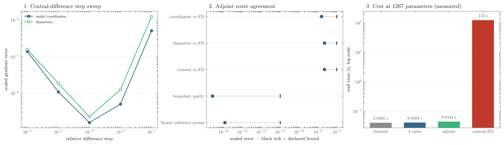

# Building a fast backward pass for a solver that has none

Unless noted, measurements use the 16×16 gridshell with 257 nodes, 496 members,
1267 differentiable parameters, and three load cases. Reproduce them with
`validation/pynite_adjoint.py`.

PyNite is a structural analysis solver in plain Python with no tape, tangent,
or sensitivity command. Correctness came first. Measurement then guided a
sequence of changes to the reverse rule.

| implementation | crossed evaluation |
|---|---:|
| exact element, implicit adjoint, dense Jacobian | 0.92 s |
| compiled element derivatives | 0.71 s |
| final reverse rule with reused factorization, force recovery, and caching | **0.077 s** |

At 0.077 s, 2408 analysis evaluations account for about three minutes. With
the code check included, the full crossed descent fell from **37 to 4.8
minutes**. The gradient stayed fixed while the implementation changed.

## Accuracy first

The JAX element must match the element PyNite assembles. Randomly oriented
members agree to **7.7e-18** in local stiffness and **5.7e-16** globally.

Circular hollow sections have equal second moments. Rolling their transverse
axes changes the global matrix by only **1.7e-16**. The assembly frame can
therefore favor conditioning, while the reporting frame remains a convention.
The reverse rule needs `∂Ke/∂p`, not the frame derivative. This result does not
extend to unequal second moments.

An approximate element rule plateaued near 1e-7. The exact element and implicit
adjoint instead agree with central differences near their expected 1e-9 floor,
with the same in-process rule at **2.587e-15**, and with frozen gradient-block
norms at **1.168e-14**. See
[results.md](results.md#validation-evidence) for the evidence ladder. The
archived measurement record draws the same ladder, and the measured cost
beside it:

## 1. Compile the element derivatives

Profiling assigned 0.0502 s to element derivatives. Compilation reduced the
same work to **0.0006 s**, an 84× change. Dispatch, not arithmetic, was the cost.

## 2. Write a reverse rule

The first implementation built a dense Jacobian. That matches a forward-mode
solver but wastes work for one scalar objective. It pays one back-substitution
per parameter. A reverse rule pays one solve.

The reverse rule pulls the cotangent through member-force recovery, gathers one
adjoint load, solves once, then contracts by element. It costs **0.046 s** versus
**0.419 s** for the dense route. The gap grows with parameter count.

OpenSees cannot use the same shortcut through its public API. Its Direct
Differentiation Method returns a column for each registered parameter. It
exposes neither an adjoint row nor the required right-hand side. Different
backends therefore use different derivative strategies and scaling laws.

## 3. Build only the needed right-hand side

Rebuilding was only 1% of one solve. The cost hid in the fixed-end reactions:
under nodal loading they are identically zero, yet building that vector of
zeros cost 0.0176 s per case. Constructing the right-hand side from known loads
took effectively zero time and agreed bit for bit.

The stiffness matrix also stays fixed across load cases. PyNite assembled once
but refactorized inside each solve. Three cases cost **0.0200 s** separately and
**0.0070 s** with one factorization. The same change could benefit any linear
multi-combination model upstream.

## 4. Recover forces from the verified element

PyNite's per-member force loop cost **0.108 s**. A mapped multiplication of the
verified element stiffness by displacements cost **0.0031 s**.

This also joined the primal and derivative. The code check now reads the same
element function that the adjoint differentiates.

## 5. Cache preparation, not results

Three load cases originally crossed separately and repeated assembly and
factorization. A wider schema looked necessary. Profiling showed otherwise.
Preparation accounts for 0.0413 s of a 0.0414 s forward pass and does not depend
on loads.

One cached frame, keyed by geometry and diameters, serves every load case and
its adjoint. Five of six calls hit. On the 16×16 shell, three load cases in
one call cost about **1.0×** a single-case call instead of 3× — the marginal
case costs less than timing noise.

One cache entry suffices because reverse mode completes forward calls before
backward calls. The key excludes loads because preparation excludes them. A
served runtime would need its own lock. Tests cover three distinct load cases
and two interleaved geometries.

## Boundary cost

With the same solver on each side, the
[Tesseract](https://github.com/pasteurlabs/tesseract-core) boundary adds
**12%**. An early measurement reported a 74× gap, but that compared Python
finite elements against a compiled XLA solver; it was not a boundary result.

The final crossed gradient uses one adjoint solve and computes only the
contraction requested by the optimizer. The boundary is no longer the
bottleneck.

## The bottleneck moves to the code check

Once analysis was cheap, the check dominated a crossed evaluation: 0.245 s
beside the 0.077 s of analysis. Reusing
solved sizing states, avoiding repeated clause-object allocation during
bisection, and removing five unnecessary halvings cut it from 0.245 s to about
0.040 s. Reported utilization still runs through the public Blueprints class.
The [Eurocode 3 backward-rule note](blueprints_backward_pass.md) gives the
derivative and branch details.

## Why not parallelize

Threads did not accelerate Blueprints' scalar Python work. A warm process pool
improved one endpoint by 2.4×, but cold startup and callback concurrency erased
the gain in the actual pipeline. The simpler serial endpoint won. The final
comparison protocol, including its rule for multiple starts, lives in
[results.md](results.md).
