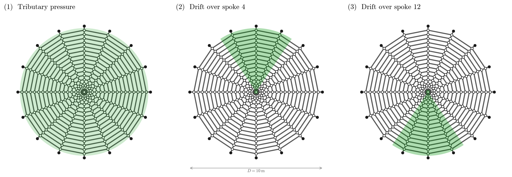
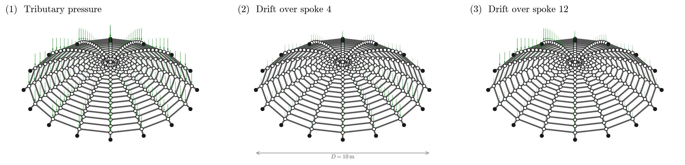
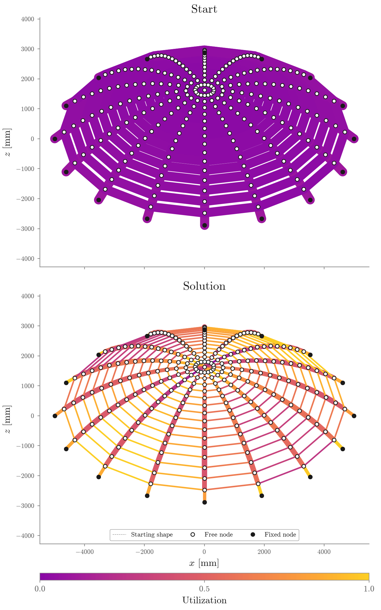
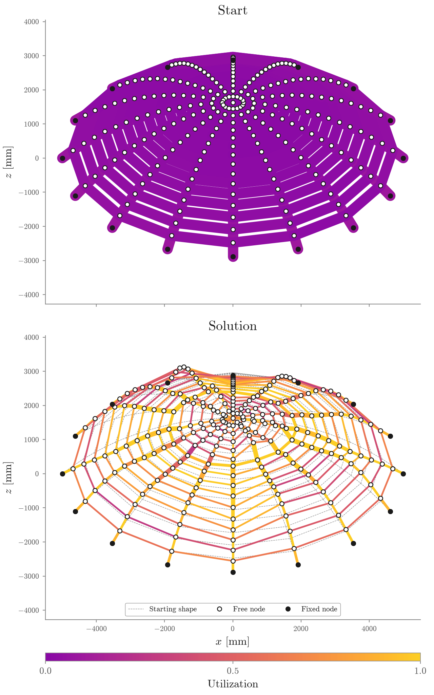
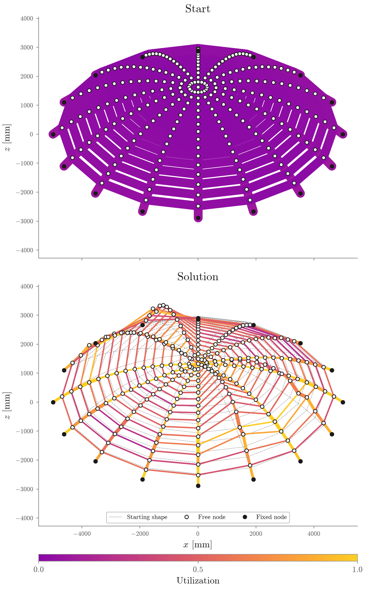

# The gridshell: a roof for a public space

A circular plaza ten meters across wants a roof: a steel gridshell dome that
shelters the space below without a single interior column. The drawn surface
is a shallow cap of 5 m radius and 2 m rise, meshed into 16 rings and 16
spokes — 257 nodes and 496 tubular members, 256 radials and 240 hoops —
supported on the 16 nodes of its boundary ring. This guide designs that roof
with the same program as [the three ravine backbones](planar_structures.md),
moved into three dimensions: the frame analysis is PyNite, a plain-Python
solver with no derivative API whose implicit adjoint is this repository's own
([its derivation](fast_backward_pass.md)), behind the analysis
[Tesseract](https://github.com/pasteurlabs/tesseract-core).

## The design problem

The objective and the check are the planar guide's: minimize total steel
mass, in tonnes, holding the implemented Eurocode 3 cross-section utilization
at or under one for every member under every load case, on Class 3 CHS
members of S355 steel with a 21.3 mm diameter floor. The shell adds three
things.

**Folded sections.** The mirror and the polar rotation fold the 496 members
into 31 section families — one tube size per ring per member family. A roof
of 496 distinct diameters is not a buildable order; 31 is. The fold is also
what every route shares, so the comparison below is between shape freedoms,
never between sizing resolutions.

**A radial sign guard.** The radial densities are held in compression through
the descent (margin fraction 0.01): let them change sign and the search
flattens the cap and hangs the members. The drawn cap needs no shift to
satisfy the guard — it is already funicular under its own tributary pressure,
every member a strut.

**Geometry limits.** A 2300 mm rise cap and a zero sag floor: the roof may
rise 300 mm above its drawing and may not dip below its supports.

The three shape parametrizations are the planar guide's, at the shell's
scale:

| label | CLI word | shape variables | with sections |
|---|---|---:|---:|
| Sections only | `fixed` | none | 31 |
| Heights + sections | `heights` | 136 folded node heights | 167 |
| End-to-end | `fdm` | 23 folded force-density coefficients | 54 |

## The load cases

<a href="../figures/problem_setup_gridshell_plan.png">
  
</a>

The roof carries a pressure of 1.0 kN/m² on its plan projection, distributed
by tributary area: each ring owns the annulus reaching halfway to its
neighbors, split evenly among its spokes, and the boundary ring's share goes
straight to ground — the unshaded rim in the plan above. That is 73.7 kN over
the 241 free nodes, and it is the case the form finding answers to.

The two other cases are drifts. Each keeps full pressure over a three-spoke
sector — centered on spoke 4 in one case and on spoke 12 in the other — and
grades the rest of the roof down to half, then rescales back to the same
73.7 kN total, so no case wins by carrying less. The plan shades only what
makes each drift one-sided: the sector standing above its own graded field,
crown included, since every sector holds the crown on its axis. The two
sectors are exact mirror images under the same reflection that folds the
design variables: neither drift is symmetric by itself, but the pair is
closed, which is what lets the fold throw none of the loading away. As in the
planar study, the cases are alternatives, not combinations, and every
(member, load case) pair is one constraint row.

On the surface itself, the same cases act as nodal forces — each free node
carrying its cell's share straight down:

<a href="../figures/problem_setup_gridshell.png">
  
</a>

## The search

The search is the same augmented Lagrangian — `auglag` in every legend —
described in [the planar guide](planar_structures.md#the-search): rounds of
inner L-BFGS-B descents, multipliers absorbing the remaining slack after each
round, the penalty growing tenfold only when a round failed to earn a quarter
of the violation it inherited, convergence declared when the worst violation
falls under $10^{-6}$ and the mass stops moving. The shell's file opens the
penalty at 0.01, gentler than the planar files, and its whole constraint set
is aggregated inside the traced program, so one gradient costs one round trip
through the two Tesseracts however many of the 1488 utilization rows are
active.

The films and `*_optimization` figures draw the two curves to read a run by:
the worst **constraints violation** on a log axis against its shaded
tolerance band, and the **mass** under it, both over the inner iterations
with rounds marked by open rings. The violation must end inside the band;
until it does, a light design is not an answer.

## Start and solutions

Every route opens on the drawn cap itself at 100 mm tubes everywhere:
1.312050 t, and — unlike every planar start — already feasible, at violation
exactly zero. The shell's search is therefore pure mass-shedding from an
oversized but lawful roof, where the planar starts first had to climb into
feasibility.

<table>
  <tr>
    <td width="33%" align="center" valign="top">
      
      <b>Sections only</b><br>
      <sub>0.138 t in 645 evaluations</sub>
    </td>
    <td width="33%" align="center" valign="top">
      
      <b>Heights + sections</b><br>
      <sub>0.091 t in 1787 evaluations</sub>
    </td>
    <td width="33%" align="center" valign="top">
      
      <b>End-to-end</b><br>
      <sub>0.081 t in 1855 evaluations</sub>
    </td>
  </tr>
  <tr>
    <td width="33%" align="center" valign="top">
      
    </td>
    <td width="33%" align="center" valign="top">
      
    </td>
    <td width="33%" align="center" valign="top">
      
    </td>
  </tr>
</table>

The films spin the solid through half a revolution while it descends, so the
back of the shell is shown once per cycle; the two curves under the drawing
are the violation and the mass described above.

## Results

| route | variables | final mass [t] | worst utilization | evaluations | final violation |
|---|---:|---:|---:|---:|---:|
| Sections only | 31 | 0.138421 | 1.000001 | 645 | $6.6\times10^{-7}$ |
| Heights + sections | 167 | 0.091303 | 1.000000 | 1787 | $3.3\times10^{-7}$ |
| End-to-end | 54 | 0.080954 | 1.000001 | 1855 | $5.7\times10^{-7}$ |

Letting the drawn cap move buys 41.52% of the sized mass under the three
pressure cases and the 21.3 mm diameter floor. Between the shaped routes the
force-density prior wins here: 11.33% lighter than free heights from a third
of the variables, settling at a rise of 2287.9 mm — 12.1 mm under the
2300 mm cap, which steers the basin without being active at the landing —
against free heights' 2194.7 mm. As [the results record](results.md)
insists, that is evidence about these accepted local landings, not a proof
that a smaller design space must win; on the arch the larger space wins by a
similar margin.

## Reproduce

```bash
uv run python examples/gridshell.py
uv run python examples/gridshell.py --shape-parametrization heights
uv run python examples/gridshell.py --shape-parametrization fixed
```

The gridshell is the largest study in the repository, and its films render
after the answer prints. The load-case diagram above is drawn without running
any search by `uv run python examples/problem_setup.py`, and
[the reproducibility guide](reproducibility.md) names every exported artifact
and the redraw commands that rebuild the films from the archives.
