# The planar structures: three backbones for one ravine

Suppose a footbridge must cross a ravine in the Grand Canyon. Two rocky
abutments fix a 10 m span, and the deck lays a known load on whatever stands
beneath it. What remains negotiable is the steel backbone that carries the
deck, and this guide designs three candidates for it: an arch, a triangulated
Warren truss, and an unbraced Vierendeel truss. All three are designed by one
program under the same loads, steel, and code-check model. The topology-specific
geometry and sign constraints, starting diameters, and search budgets are stated
below.

Each candidate is one driver and the YAML file beside it — `examples/arch.py`,
`examples/warren.py`, `examples/vierendeel.py`. The gridshell roof is the same
story in three dimensions, told in [its own guide](gridshell.md).

## The design problem

Every run minimizes total steel mass, in tonnes, over shape and section
variables simultaneously. The shape variables depend on the route (below);
the section variables are always one outer diameter per mirror-folded member
family, every member a circular hollow section of S355 steel fixed at the
Class 3 slenderness limit. The constraints are:

- **Utilization at most one, per member and per load case.** Utilization is
  the implemented Eurocode 3 cross-section check — axial force with biaxial
  bending — evaluated by Blueprints behind the sizing
  [Tesseract](https://github.com/pasteurlabs/tesseract-core). Every
  (member, load case) pair is its own constraint row; nothing is enveloped.
- **Geometry rows**: a rise cap and a sag floor on the free node heights, and
  a member-length floor where the topology needs one (500 mm on the Warren,
  1000 mm — the drawn depth — on the Vierendeel, so no panel may collapse).
- **Sign guards** on the force densities where the start can sign them: both
  chords held in compression on the Warren; chords in compression and
  verticals in tension on the Vierendeel. The arch needs no guard — its
  density box keeps the one sign a chain has.
- **A diameter floor** of 21.3 mm, held as a box bound.

One gradient serves the whole problem. It runs backward from mass and the
constraint rows through the Blueprints check (a hand-derived adjoint), through
the OpenSees frame analysis (compiled DDM sensitivities), and through the
JAX FDM form finding (implicit differentiation), crossing the two Tesseract
boundaries on every evaluation.

Each driver exposes three shape parametrizations through
`--shape-parametrization`; the labels below match the README's gridshell
figures:

| label | CLI word | what the search moves |
|---|---|---|
| Sections only | `fixed` | diameters alone; the drawn geometry never moves |
| Heights + sections | `heights` | free node heights and diameters |
| End-to-end | `fdm` | force-density coordinates and diameters, one gradient through all three stages |

All three routes of one structure open on the same geometry and the same
diameters, so the comparison isolates shape freedom. The comparison rules and
the acceptance protocol live in [the results record](results.md).

## The load cases

<a href="../figures/problem_setup_landscape.png">
  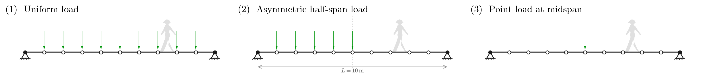
</a>

The deck carries three load cases, stated once and shared verbatim by the
three YAML files:

| case | total | where it lands |
|---|---:|---|
| LC1 — uniform | 180 kN | equal shares over every deck node |
| LC2 — asymmetric half-span | 90 kN | equal shares over the deck nodes of the near half |
| LC3 — midspan point | 90 kN | the single deck node at midspan |

A deck node is a free node at the lowest drawn height: the nine free nodes of
the flat-drawn arch, the seven free bottom-chord nodes of either truss. Loads
act straight down at nodes, supports take no applied load, and each stated
total is exactly what the free nodes carry. By midspan symmetry the far-half
case is only a reindexing of the near half, so it is not run.

Two readings matter. The cases are **alternatives, not combinations** — each
one is a complete set of utilization rows and all rows are held at once, with
no load-combination factors on top: the totals are design actions. And the
**first case is also the load the form finding answers to**, so the searched
shape is funicular for LC1 and merely checked against LC2 and LC3.

## The search

Every route descends by an augmented Lagrangian — `auglag` in every figure
legend. One round is an inner L-BFGS-B descent of the augmented objective;
after it, the multipliers absorb the remaining constraint slack, and the
penalty grows tenfold only when the round failed to take a quarter off the
violation it inherited. Three warmup rounds get 400 inner iterations each,
later rounds 50 to 100, and the search stops when the worst violation falls
under $10^{-6}$ and the mass has stopped moving in relative terms. The whole
aggregation happens inside the traced program, so one round trip through the
Tesseracts prices one gradient whatever the number of constraint rows.

The `*_optimization` figures and films draw exactly two curves over the inner
iterations, round boundaries marked by open rings:

- **Constraints violation** (upper panel, log axis): the worst constraint row
  at every iterate, with the $10^{-6}$ tolerance drawn as a shaded band. It
  must end inside the band; until it does, the design is not an answer.
- **Mass** (lower panel): the objective at every iterate.

Read the violation before believing a mass. The optimizer is free to visit
lighter, infeasible designs on the way — the planar starts themselves violate
the check — and only the accepted feasible landing counts.

## The arch

The purest candidate: a chain of 10 members over 11 nodes, drawn flat and
pinned at both abutments. Its held-plan force-density subspace is
one-dimensional, so the end-to-end route searches a single shape coefficient plus
five folded diameters — the smallest shaped design space in the project — and
reads no drawn height at all. The start is nearly flat (a 50 mm parabola at 250 mm
tubes, 0.254387 t): it carries the deck almost entirely in bending and opens
far outside the feasible set, at violation 2.7.

<table>
  <tr>
    <td width="33%" align="center" valign="top">
      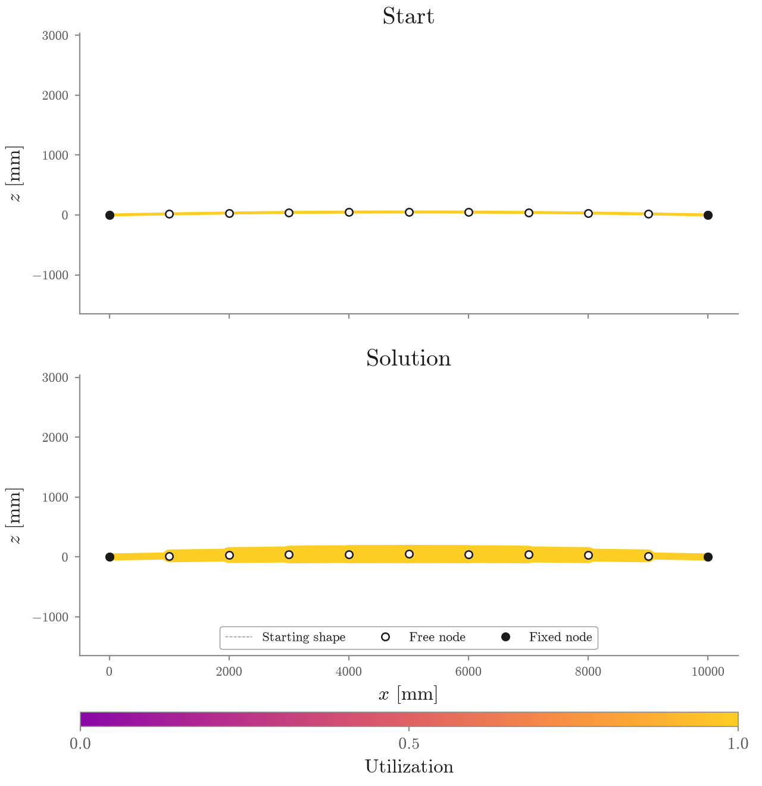
      <b>Sections only</b><br>
      <sub>0.518 t in 81 evaluations</sub>
    </td>
    <td width="33%" align="center" valign="top">
      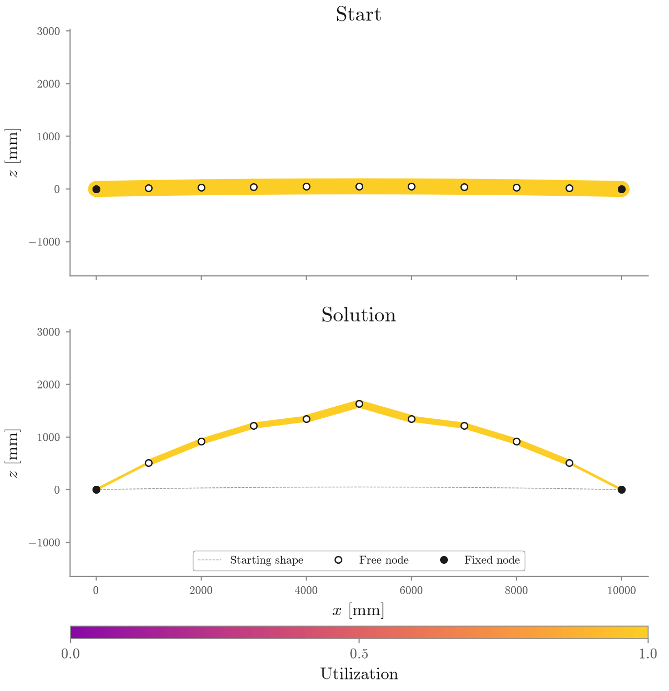
      <b>Heights + sections</b><br>
      <sub>0.155 t in 758 evaluations</sub>
    </td>
    <td width="33%" align="center" valign="top">
      
      <b>End-to-end</b><br>
      <sub>0.172 t in 129 evaluations</sub>
    </td>
  </tr>
  <tr>
    <td width="33%" align="center" valign="top">
      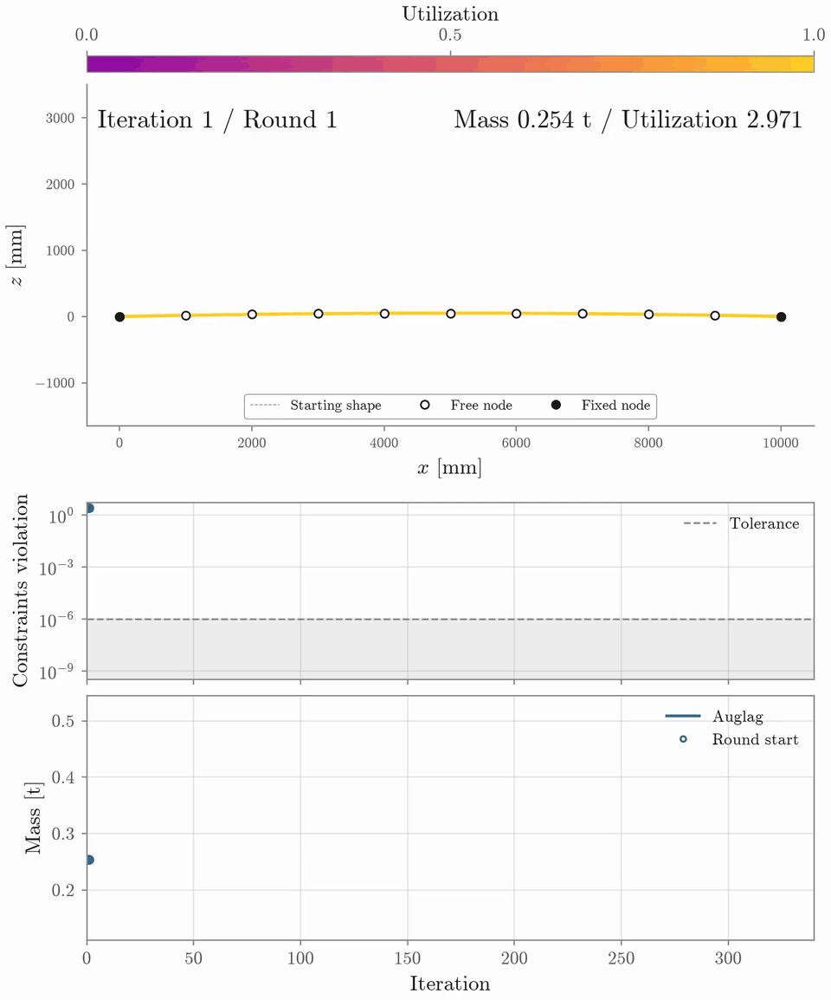
    </td>
    <td width="33%" align="center" valign="top">
      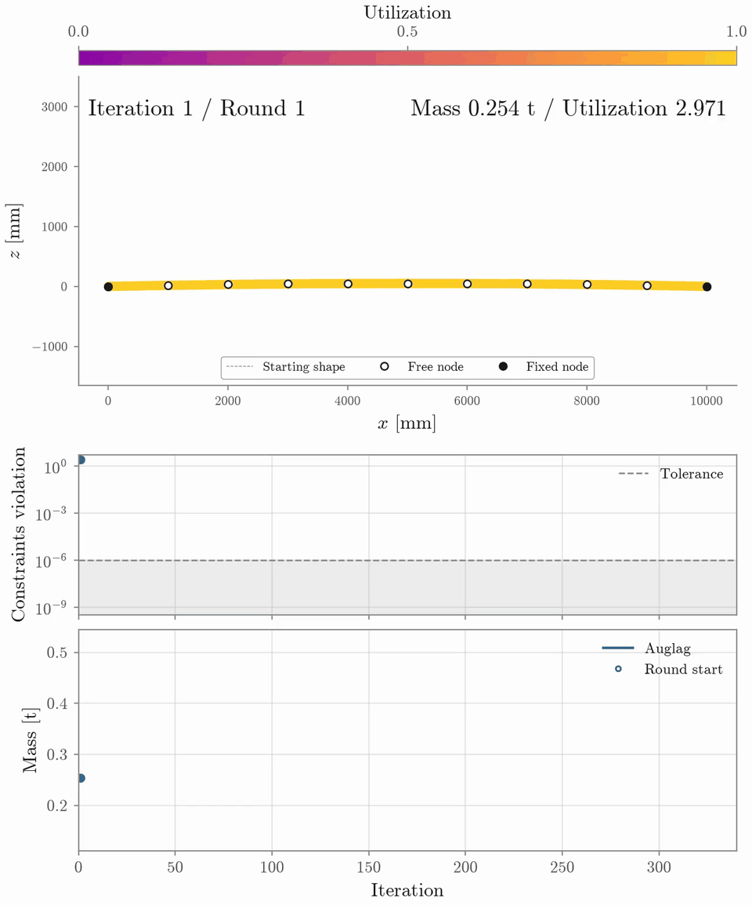
    </td>
    <td width="33%" align="center" valign="top">
      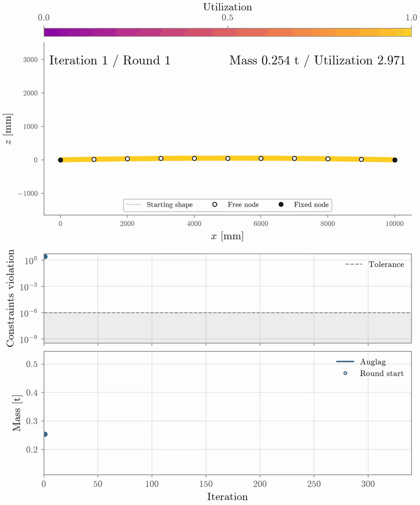
    </td>
  </tr>
</table>

| route | variables | final mass [t] | worst utilization | evaluations |
|---|---:|---:|---:|---:|
| Sections only | 5 | 0.517654 | 1.000000 | 81 |
| Heights + sections | 10 | 0.154561 | 1.000000 | 758 |
| End-to-end | 6 | 0.171684 | 1.000000 | 129 |

Letting the flat drawing rise buys 66.83% of the sized mass under these three
deck cases and the 21.3 mm diameter floor. Between the two shaped routes the
larger space wins here: free heights lands 9.97% lighter, settling a parabola
of rise 1632 mm against the funicular route's 1398 mm. That is the expected
direction — five folded heights contain every shape one coefficient can
reach — and [the results record](results.md#permitted-claims) forbids
assuming the prior must be lighter. What the one-coefficient route offers is
one shape variable against five, a sixth of the evaluations, and complete
indifference to how the arch was drawn.

## The Warren truss

The triangulated candidate: 8 bays over a 10 m span at 1 m drawn depth, 17
nodes and 31 members, pinned at both ends of the bottom chord. Its
force-density basis is nine wide under the mirror fold, and both chords are
guarded into compression — the diagonals need no guard, since each reverses
its sign across midspan, and none can collapse: their plan projections
already exceed the 500 mm length floor. The start is a shallow double-arched
sketch of itself at 100 mm tubes (0.154016 t), opening just outside the
feasible set at violation 0.01.

<table>
  <tr>
    <td width="33%" align="center" valign="top">
      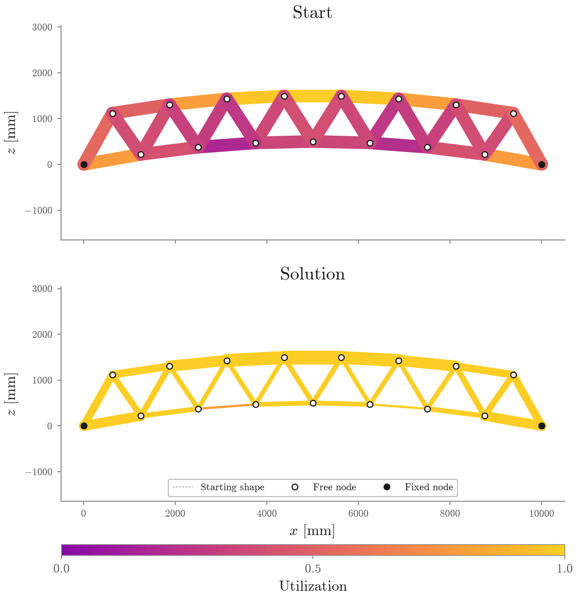
      <b>Sections only</b><br>
      <sub>0.072 t in 208 evaluations</sub>
    </td>
    <td width="33%" align="center" valign="top">
      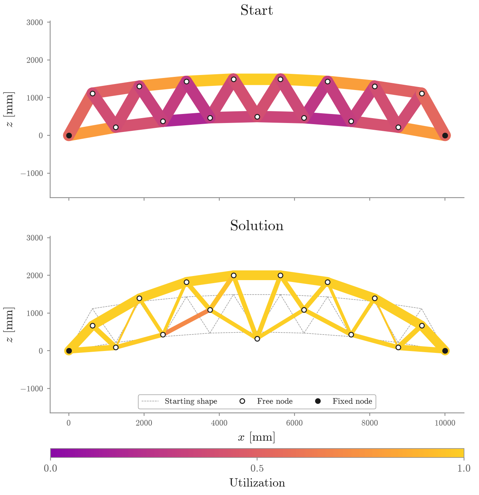
      <b>Heights + sections</b><br>
      <sub>0.051 t in 1856 evaluations</sub>
    </td>
    <td width="33%" align="center" valign="top">
      
      <b>End-to-end</b><br>
      <sub>0.051 t in 2243 evaluations</sub>
    </td>
  </tr>
  <tr>
    <td width="33%" align="center" valign="top">
      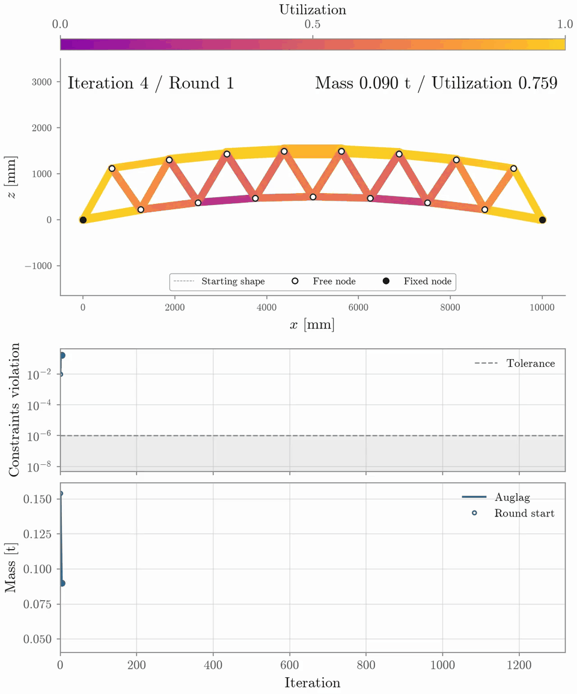
    </td>
    <td width="33%" align="center" valign="top">
      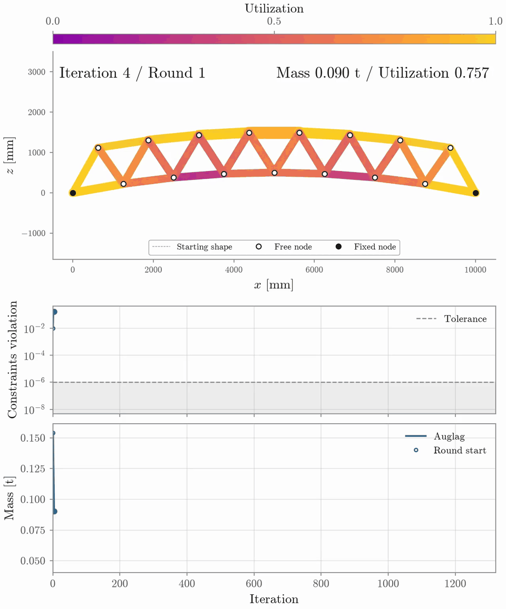
    </td>
    <td width="33%" align="center" valign="top">
      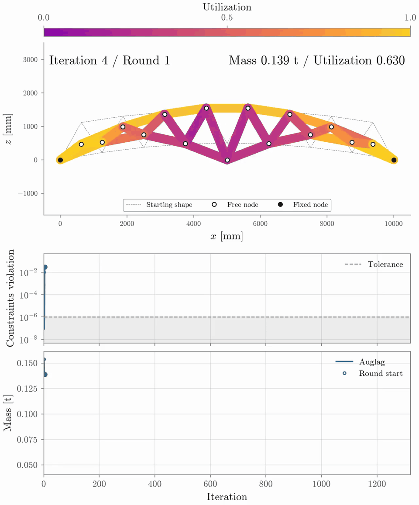
    </td>
  </tr>
</table>

| route | variables | final mass [t] | worst utilization | evaluations |
|---|---:|---:|---:|---:|
| Sections only | 16 | 0.071797 | 1.000000 | 208 |
| Heights + sections | 24 | 0.051188 | 1.000000 | 1856 |
| End-to-end | 25 | 0.050743 | 1.000001 | 2243 |

Geometry buys 29.32% here under the same loads and floor — the smallest
saving of the three, because a drawn truss with diagonals is already a
reasonable structure. The two shaped routes land 0.87% apart, a near tie:
nine force-density coordinates and eight folded heights span essentially the
same freedom on a triangulated topology, and both push the top chord onto the
2000 mm rise cap.

## The Vierendeel truss

The hard candidate: the same 8 bays and 1 m depth, but no diagonals — 23
members over 18 nodes, pinned at both ends of both chords. Without
triangulation the drawn frame carries the deck through joint bending alone,
which is exactly what a funicular shape starves. The searched subspace is six
wide under the held plan; both chords are guarded into compression and the
verticals into tension, and the 1000 mm length floor keeps every panel at
least as deep as drawn. The start (0.110419 t) opens at violation 3.1, the
farthest from feasibility in the project — its landing is *heavier* than the
start's number, because the start is not a design: it fails the check, and
the descent must buy feasibility before it can shed mass. This search also
carries the largest round budget (20 against 12 elsewhere).

<table>
  <tr>
    <td width="33%" align="center" valign="top">
      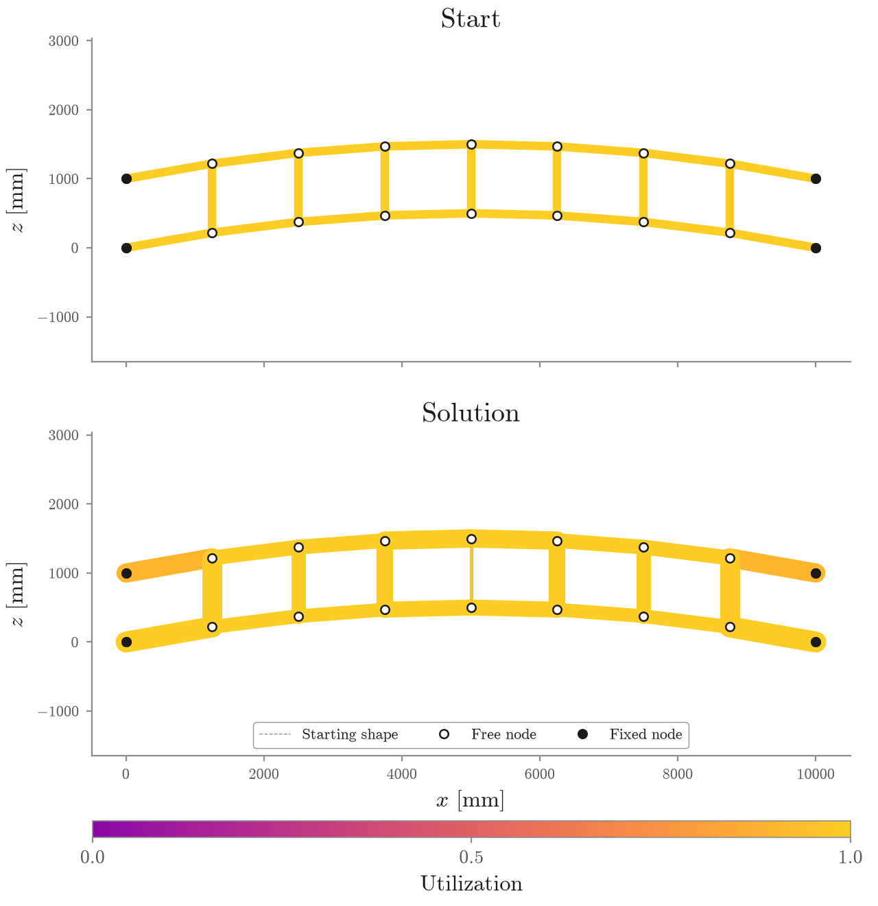
      <b>Sections only</b><br>
      <sub>0.277 t in 1222 evaluations</sub>
    </td>
    <td width="33%" align="center" valign="top">
      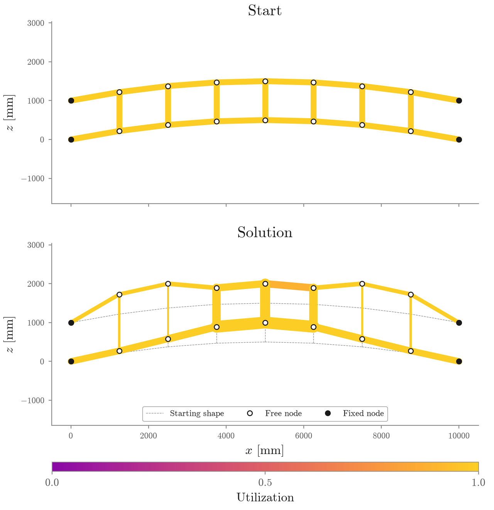
      <b>Heights + sections</b><br>
      <sub>0.136 t in 2193 evaluations</sub>
    </td>
    <td width="33%" align="center" valign="top">
      
      <b>End-to-end</b><br>
      <sub>0.121 t in 3110 evaluations</sub>
    </td>
  </tr>
  <tr>
    <td width="33%" align="center" valign="top">
      
    </td>
    <td width="33%" align="center" valign="top">
      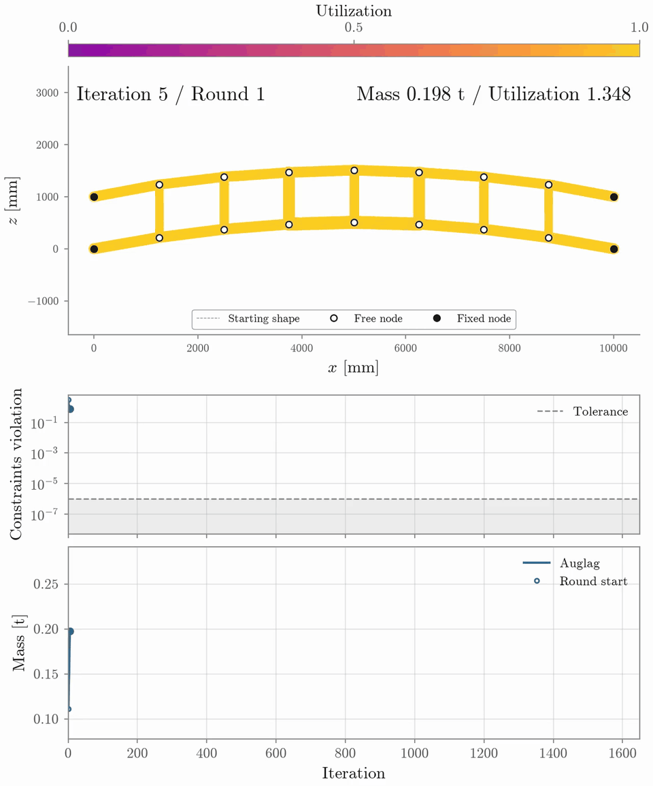
    </td>
    <td width="33%" align="center" valign="top">
      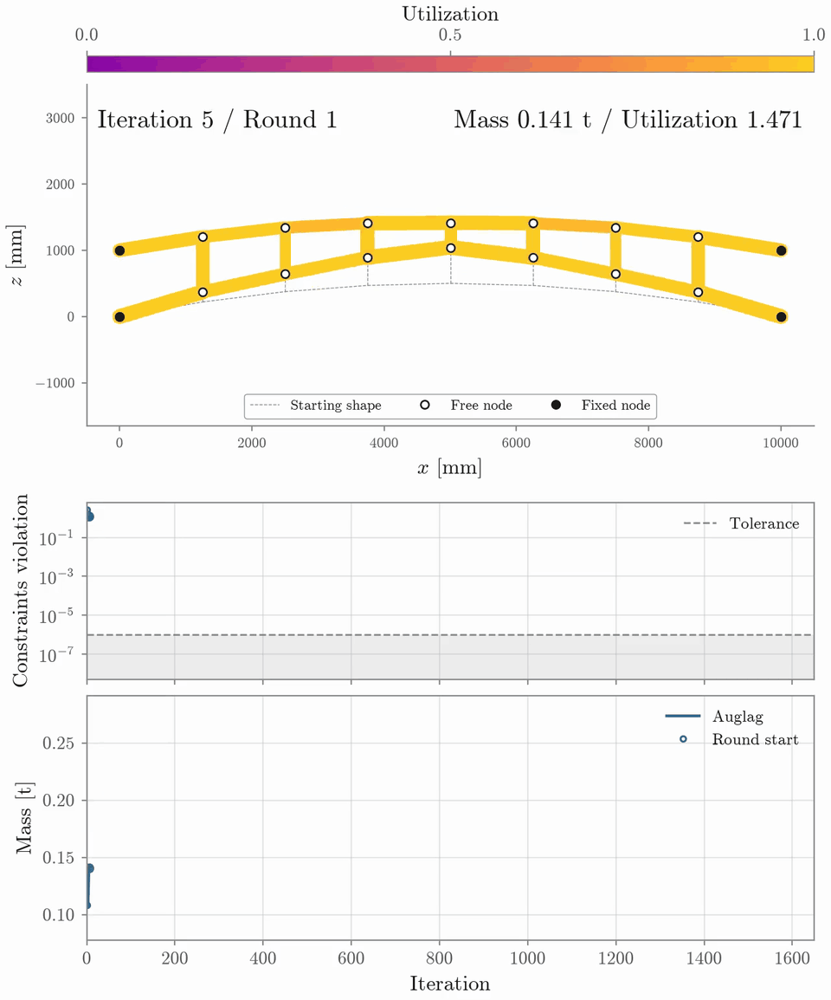
    </td>
  </tr>
</table>

| route | variables | final mass [t] | worst utilization | evaluations |
|---|---:|---:|---:|---:|
| Sections only | 12 | 0.277435 | 1.000000 | 1222 |
| Heights + sections | 20 | 0.136498 | 1.000000 | 2193 |
| End-to-end | 18 | 0.120819 | 1.000001 | 3110 |

Geometry buys 56.45% under the stated loads and floor — the drawn Vierendeel
needs 0.277 t of steel to carry moments its arched form nearly eliminates.
This is also where the force-density prior earns its keep: end-to-end lands
11.49% lighter than free heights from a smaller design space, with the top
chord pressed onto its 2000 mm rise cap and every vertical held exactly at
the drawn depth by the length floor.

## What the three answers say

Read as one study, under the shared 180/90/90 kN deck cases and the 21.3 mm
diameter floor:

- **Moving the geometry is the big lever.** The end-to-end designs land
  66.83% (arch), 29.32% (Warren), and 56.45% (Vierendeel) lighter than sizing
  the drawn geometry. The saving is largest where the drawn form fights its
  load path and smallest where triangulation already carries it.
- **The force-density prior is not a free win, and the study says so.** Free
  heights lands 9.97% lighter on the arch; end-to-end lands 0.87% lighter
  on the Warren and 11.49% lighter on the bending-dominated Vierendeel. What
  the prior buys everywhere is a smaller design space and a shape that never
  depends on how the drawing was made.
- **Every number is one converged local landing** under the acceptance
  protocol — not a global optimum, and not a code-complete design. The
  boundaries of what may be claimed from this table are written in
  [the results record](results.md#permitted-claims).

## Reproduce

Each driver runs its end-to-end route by default and the baselines by flag:

```bash
uv run python examples/arch.py
uv run python examples/warren.py --shape-parametrization heights
uv run python examples/vierendeel.py --shape-parametrization fixed
```

The load-case diagram above is drawn without running any search:

```bash
uv run python examples/problem_setup.py
```

Runs export their archives under `data/` and their figures and films under
`figures/`; [the reproducibility guide](reproducibility.md) names every
artifact and the redraw commands that rebuild the films from the archives.
