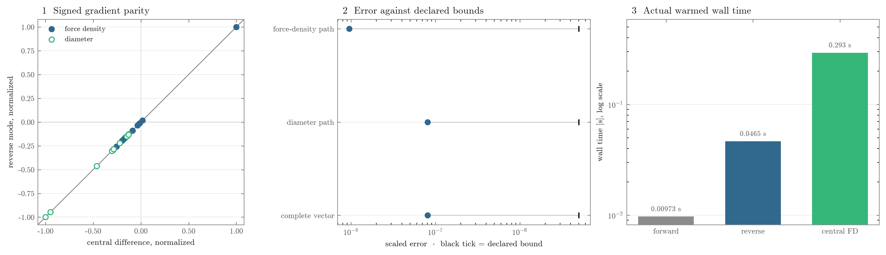

# Results and experiment protocol

This file defines every headline comparison. Its tables contain accepted runs
from the final configurations of the arch, the Warren, the Vierendeel, and the
gridshell. The gridshell completes the same three-route comparison in three
dimensions through PyNite. The numbers are narrated per structure in
[the planar structures guide](planar_structures.md) and
[the gridshell guide](gridshell.md); this file is where they are defined and
bounded.

## Research question

Can a structural shape prior be optimized through real analysis and code-check
software? Normax minimizes steel mass while constraining cross-section
utilization, geometry, and configured force-density signs. The end-to-end route
optimizes force densities and diameters together.

| structure | role | analysis |
|---|---|---|
| arch | one force-density coordinate against free heights | OpenSees |
| Warren truss | triangulated planar frame with a held plan | OpenSees |
| Vierendeel truss | bending-dominated planar frame | OpenSees |
| gridshell | space frame with folded section families | PyNite |

Every route uses Blueprints for the crossed Eurocode 3 cross-section check.

## Comparison

Each driver and YAML pair exposes three shape parametrizations:

| label | CLI word | variables | interpretation |
|---|---|---|---|
| end to end | `fdm` | held-plan force-density coordinates and diameters | all three stages share one gradient |
| free heights | `heights` | permitted node heights and diameters | larger shape space without the funicular prior |
| sizing only | `fixed` | diameters | common starting geometry stays fixed |

Within a three-way comparison, topology, loads, material, section class,
backends, section groups, optimizer, starting geometry, and starting diameters
are fixed. The end-to-end route reproduces that geometry through force
densities, the free-heights route writes it as nodal heights, and sizing only
holds it. The final YAML and CLI form the executable protocol.

The planar cases use 180 kN over the full deck, 90 kN over the near half, and
90 kN at midspan. Midspan symmetry makes the far-half case a reindexing of the
near half. The gridshell uses a tributary pressure case and two reflected
three-spoke sector cases. Each pressure case carries the same total; the sector
pair closes under the same mirror used to fold the design variables.

The design spaces are intentionally unequal. Free heights usually contains the
force-density shapes and adds variables. Sizing only measures the value of
moving the common starting geometry. It is a baseline, not a competing shape
method. Every report states the start so that equality can be checked rather
than assumed: the three routes of one structure open on one recorded mass —
0.254387 t for the arch, 0.154016 t for the Warren, 0.110419 t for the
Vierendeel, 1.312050 t for the gridshell — with their archives' first
objectives agreeing to floating-point precision. A start is not a design: the
three planar starts
violate the check (worst violations 2.7, 0.01, and 3.1), while the drawn
gridshell cap opens feasible at exactly zero.

## Acceptance protocol

A landing enters the final table only when:

1. It comes from the submission commit and final YAML.
2. Resolved package versions are recorded.
3. The driver exits normally and reports its reason.
4. Worst violation meets `optimization.violation_tol`.
5. Mass is recomputed from the returned parameters.
6. The `.npz` record and figures identify structure and route.
7. Multi-start comparisons give each route the same declared start budget and
   compare the same statistic.

Evaluation counts measure search effort, not portable runtime. These are local
optima. They are not global certificates.

## Final headline table

Mass is reported in tonnes. Worst utilization and objective evaluations come
from each accepted report.

| structure | route | final mass [t] | worst utilization | evaluations |
|---|---|---:|---:|---:|
| arch | end to end | 0.171684 | 1.000000 | 129 |
| arch | free heights | 0.154561 | 1.000000 | 758 |
| arch | sizing only | 0.517654 | 1.000000 | 81 |
| Warren | end to end | 0.050743 | 1.000001 | 2243 |
| Warren | free heights | 0.051188 | 1.000000 | 1856 |
| Warren | sizing only | 0.071797 | 1.000000 | 208 |
| Vierendeel | end to end | 0.120819 | 1.000001 | 3110 |
| Vierendeel | free heights | 0.136498 | 1.000000 | 2193 |
| Vierendeel | sizing only | 0.277435 | 1.000000 | 1222 |
| gridshell | end to end | 0.080954 | 1.000001 | 1855 |
| gridshell | free heights | 0.091303 | 1.000000 | 1787 |
| gridshell | sizing only | 0.138421 | 1.000001 | 645 |

| derived comparison | value |
|---|---:|
| arch: end to end vs sizing only | 66.83% less mass |
| Warren: end to end vs sizing only | 29.32% less mass |
| Vierendeel: end to end vs sizing only | 56.45% less mass |
| gridshell: end to end vs sizing only | 41.52% less mass |
| arch: free heights vs end to end | 9.97% less mass |
| Warren: end to end vs free heights | 0.87% less mass |
| Vierendeel: end to end vs free heights | 11.49% less mass |
| gridshell: end to end vs free heights | 11.33% less mass |

| geometry descriptor | value |
|---|---:|
| arch end-to-end rise [mm] | 1397.6 |
| arch free-heights rise [mm] | 1632.2 |
| gridshell end-to-end rise [mm] | 2287.9 |
| gridshell free-heights rise [mm] | 2194.7 |

### Gridshell result record

The three gridshell routes start from the same 16-by-16 topology, 2000 mm
rise, 100 mm diameters, 1.312050 t mass, material, section model, three
pressure load cases, PyNite analysis, Blueprints check, optimizer, and
$10^{-6}$ acceptance tolerance. Only the shape variables differ: 23 folded
force-density coefficients plus 31 section variables for end to end, 136
folded nodal heights plus the same 31 sections for free heights, and the 31
sections alone for sizing only.

The accepted records are the committed archives `data/gridshell.npz`,
`data/gridshell_heights.npz`, and `data/gridshell_fixed.npz`, digested with
their drivers and configurations in
[`data/accepted_results.json`](../data/accepted_results.json). Final
violations are respectively $5.66\times10^{-7}$, $3.33\times10^{-7}$, and
$6.64\times10^{-7}$; every route's console report ended `converged` and
`Is the design safe? True`.

The 2300 mm rise cap is shared by the movable-shape routes. The end-to-end
answer settles at 2287.9 mm, 12.1 mm below it, so the cap steers the search
basin but is not active at the accepted landing. In this local comparison the
force-density prior is 11.33% lighter than the larger free-heights search. That
is evidence about these accepted local landings, not a general proof that a
smaller design space must win.

## Permitted claims

The architectural claim is direct. Objective and constraint evaluations cross
the analysis and Blueprints boundaries, then reverse mode returns through them.
[Tesseract](https://github.com/pasteurlabs/tesseract-core) sits inside the
optimization path.

Numeric claims must stay narrower:

- Compare end to end with sizing only to price moving the common starting
  geometry.
- Compare end to end with free heights to study the shape prior, dimension,
  feasibility, and evaluation count. Do not assume the prior must be lighter.
- Claim robustness only after a declared multi-start study.
- Attach loads and section floors to every saving percentage.

Do not mix historical masses with the final table. Earlier experiments used a
different moment reduction or different public examples.

## Validation evidence

The shipped evidence has four layers:

- OpenSees DDM and the PyNite adjoint against central differences of their own
  forward solves.
- Blueprints adjoints against central differences, implicit derivatives, and
  closed-form section algebra.
- Full compositions against central differences of the crossed forward pass.
- Host and Tesseract parity for values and reverse rules.

The layers are deliberately different: central differences expose local
derivative errors, closed forms guard the section algebra, full compositions
guard the crossed pass, parity guards the boundary, and frozen norms catch
drift. None is a universal proof, so reported claims remain scoped to the
checked configurations.

The composition layer, drawn from the archived measurement record that
`uv run python validation/plot_pipeline_validation.py` regenerates with its
provenance:

See [reproducibility.md](reproducibility.md#focused-gradient-validation) for
commands and [fast_backward_pass.md](fast_backward_pass.md) for the PyNite
derivation.

## Scope and limitations

### Simultaneous and nested searches differ

Headline results use simultaneous shape and diameter variables. Stiffness
feedback is therefore inside the differentiated problem.

The optional route in `normax/optimization/nested.py` freezes seed diameters
during each inner descent and refreshes them between rounds. Its gradient omits
the nested `∂d/∂q` path. Staggered re-sectioning repairs the returned forward
design, not the inner derivative. Do not use this route for a headline gradient
claim.

### Eurocode 3 scope

Blueprints evaluates Eurocode 3 cross-section resistance under axial force with
biaxial bending for circular hollow sections. Every headline configuration
fixes Class 3 before optimization, precomputes its limiting
$d/t=90(235/f_y)$ ratio, and varies only outer diameter. It does not check
member flexural buckling under §6.3.1. A validation comparison exposes that gap
without adding buckling to the design. The
[backward-rule guide](blueprints_backward_pass.md) derives this exact slice.

Shear, torsion, and their interactions are also absent. §6.2.10 permits that
below half the plastic shear resistance, and every frozen design stays there. Loads act at nodes alone, so the moment varies linearly and the shear is
constant along a member at $\Delta M/L$; the analysis schema reports the two end
moments without stating which rotational sense they share, so both readings are
taken and the larger kept. Every ratio below is therefore an upper bound the
true value cannot exceed, computed with $A_v=2A/\pi$ per §6.2.6(3) and
$\gamma_{M0}=1.0$.

| structure | end to end | free heights | sizing only |
|---|---:|---:|---:|
| arch | 0.208 | 0.208 | 0.447 |
| Warren | 0.017 | 0.018 | 0.021 |
| Vierendeel | 0.173 | 0.169 | 0.235 |
| gridshell | 0.104 | 0.184 | 0.131 |

The worst bound anywhere is 0.447, on the arch sized at its fixed drawn
geometry; no answer whose geometry moved exceeds 0.208, and the Warren never
exceeds 0.021.
That worst margin is real but not large, and it belongs to the one route whose
geometry never moves — a shallower or longer-spanned structure sized without
form finding is where the assumption would fail first. The claim is exactly
this: designing for shear moves no diameter here.

Planar nodal loads produce zero torsion. This says nothing about arbitrary space
frames. Circular hollow sections avoid lateral-torsional buckling, but not the
omitted flexural-member or global-stability checks.

### Other exclusions

- Self-weight does not update the prescribed loads.
- Diameters are continuous. Product catalogs, connections, erection, and other
  buildability constraints are absent.
- Global stability and critical load factors are not checked.
- Analysis is linear elastic. Claims exclude unmodeled combinations,
  imperfections, and second-order effects.

### Numerical interpretation

Report the accepted feasible landing, environment, and start protocol. The
optimizer can visit lighter infeasible points. Floating-point builds can select
different local basins. One run does not define a distribution or prove global
optimality.
